## Nama : Averose Arthur R
## TI-1H / week 12

pengerjaan hanya latihan
## latihan 1

1. 
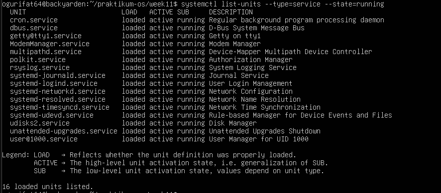

2.
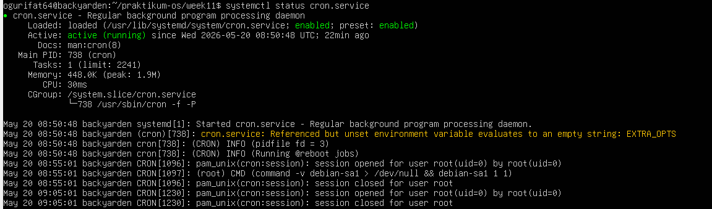
ket
scheduler yang berjalan di background

3. 
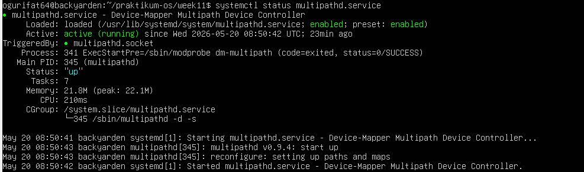
ket
layanan pada sistem operasi Linux yang berfungsi untuk mengelola dan memantau beberapa jalur (path) 
input/output (I/O) antara server dan perangkat penyimpanan eksternal

4. 
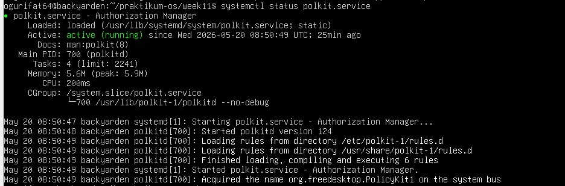
ket
 kerangka kerja (framework) otorisasi pada sistem operasi Linux yang mengatur izin akses.

5. 
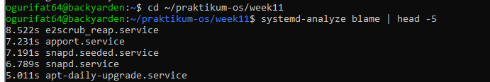

6. 
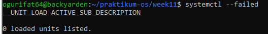

no error

## latihan 2
1. 

2. 
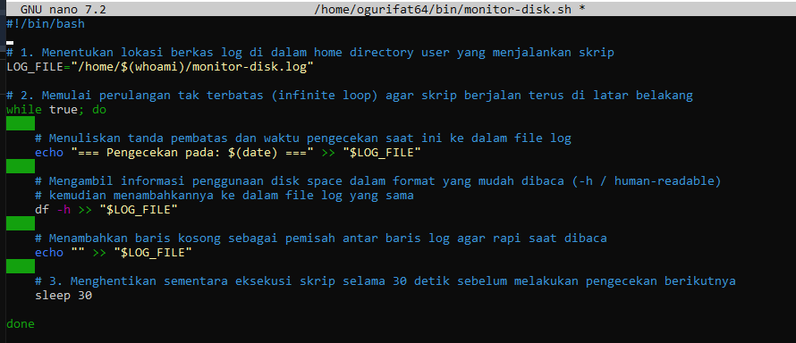
3. 

4. 
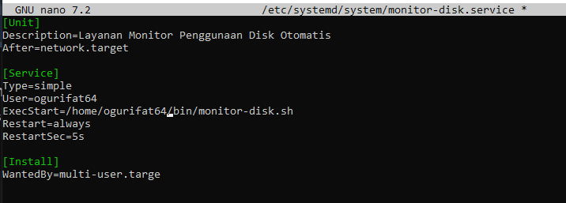
5. 
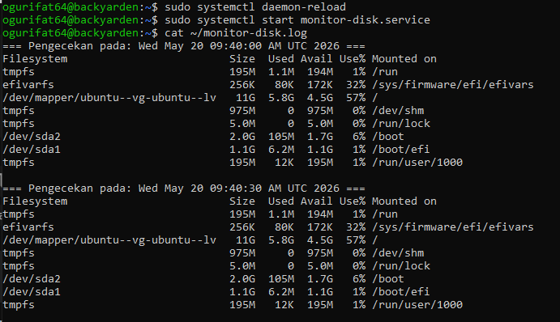
6. 
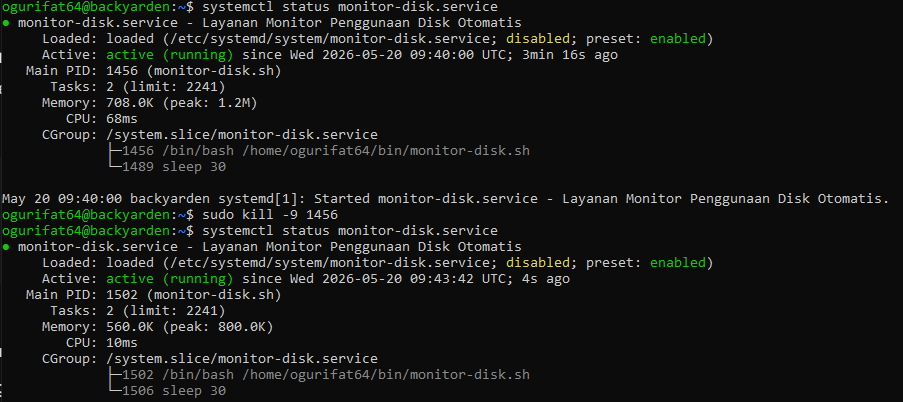
7. 
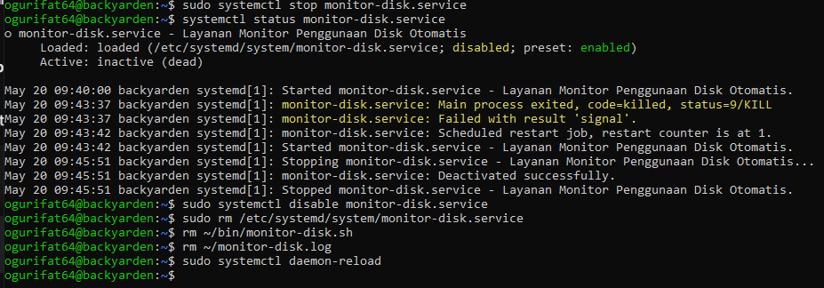

## latihan 3
1. 
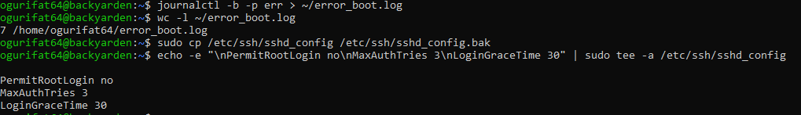
2. 
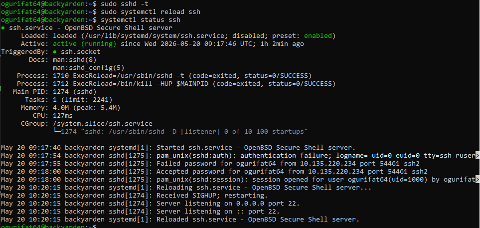
3. 
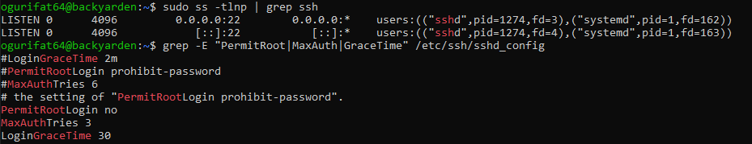
4. 
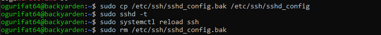