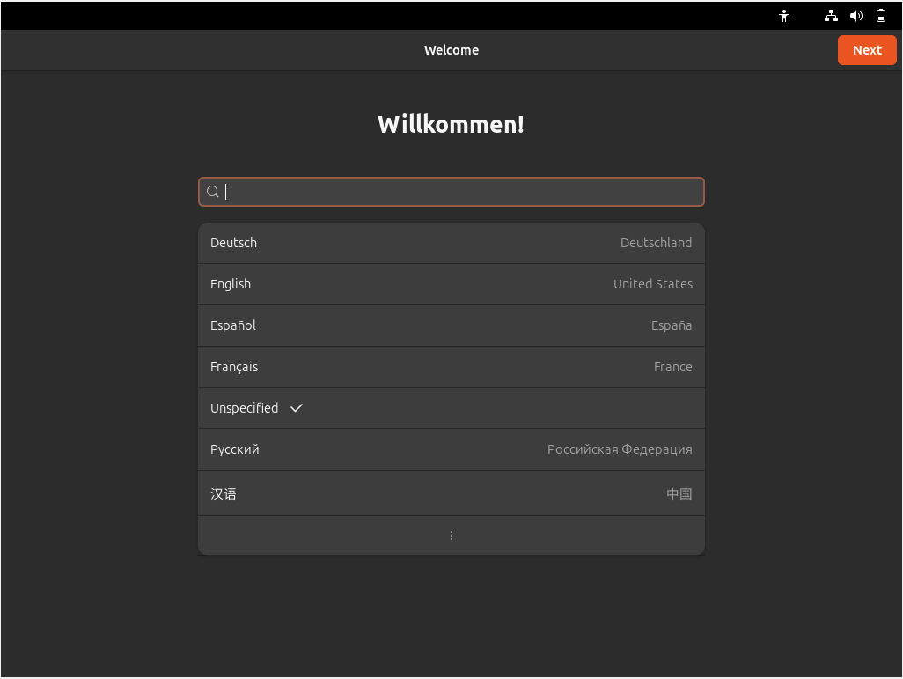
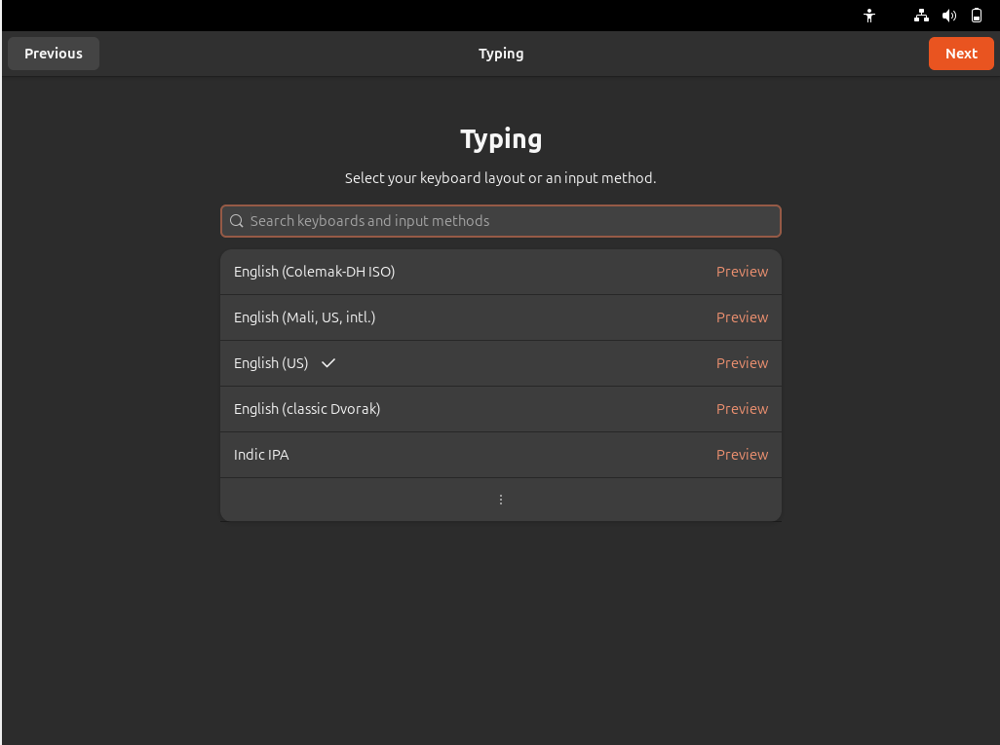
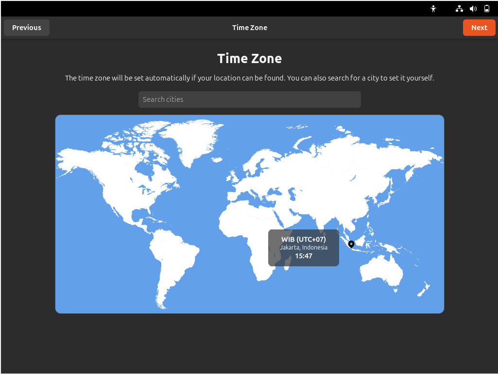
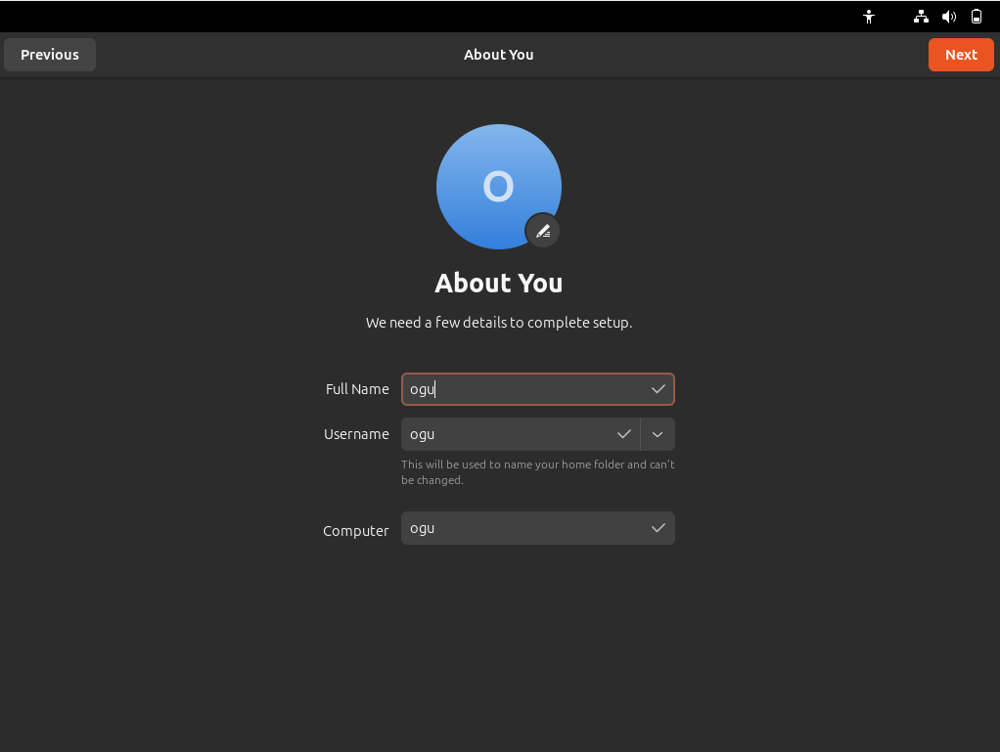
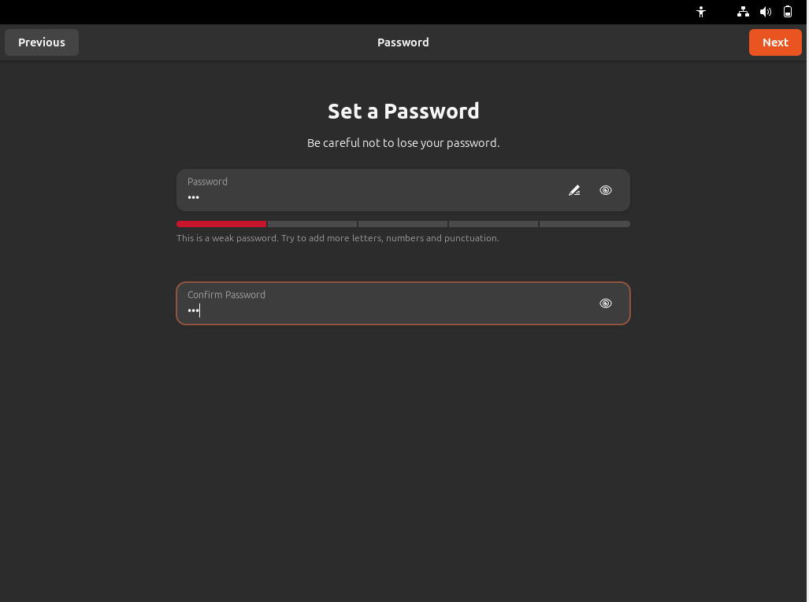
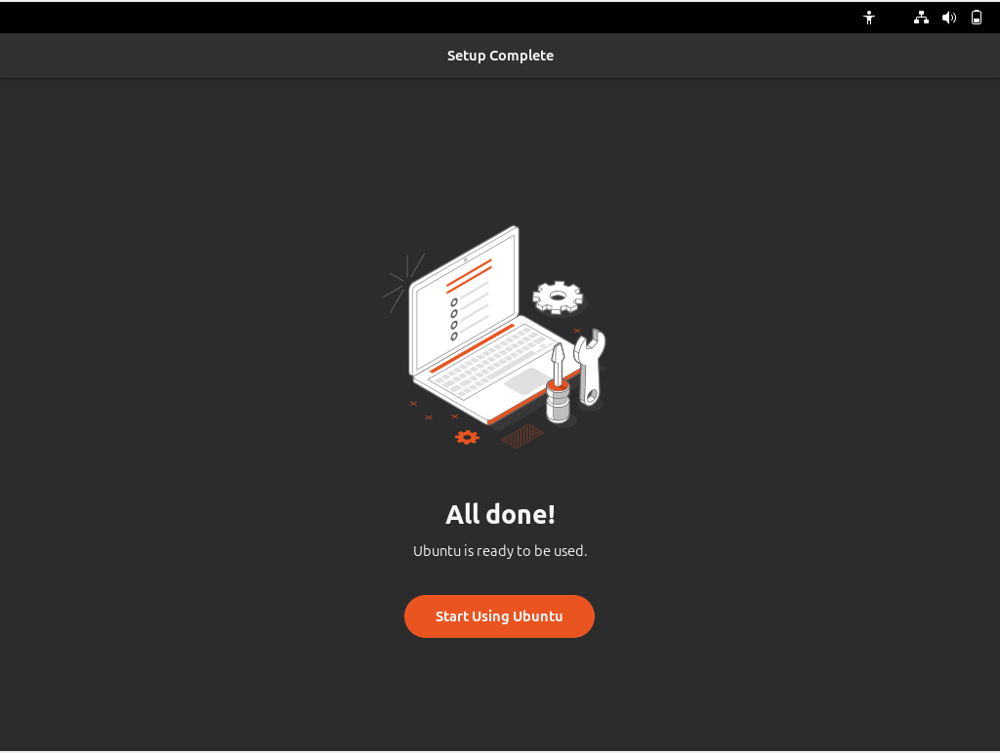
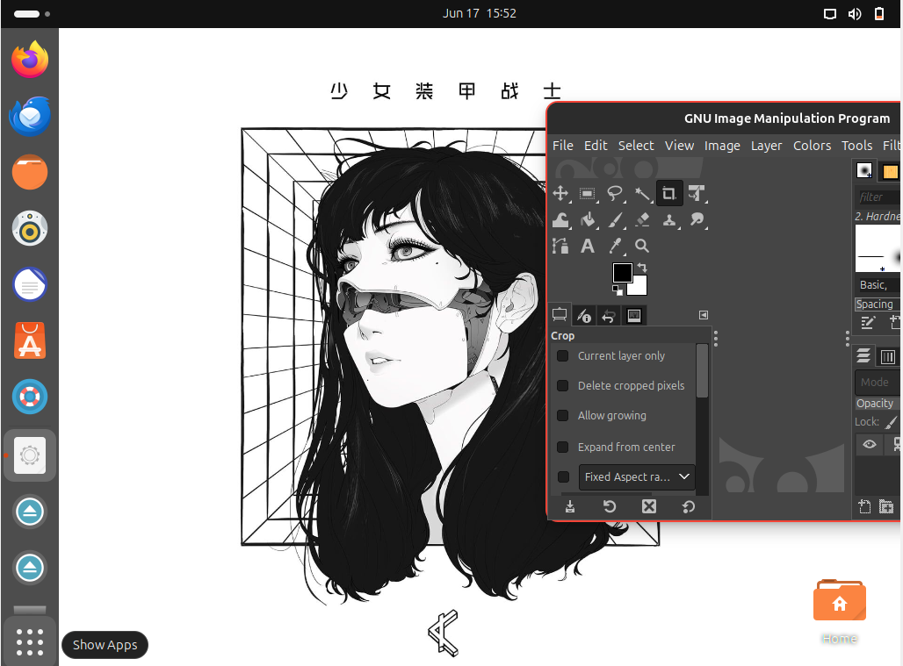

## AVEROSE ARTHUR R/TI-1H/04
## Lunatu Remaster RESULT
 1. installing step - by step

 

 

 

Set a local Username
 
Set password
 

 

 Results

 

 Perlu diperhatikan, lakukan " sudo apt install gnome-tweaks " di terminal
 lalu buka aplikasi tweak untuk mengganti tema dan icon