# Averose Arthur R
**Student ID:** 254107020042  
**Class:** TI - 1H

---

## Latihan 1.1
Jelaskan 5 fungsi utama sistem operasi dengan contoh konkret dari minimal 2 OS berbeda (Windows, macOS, atau Linux).

### 5 Fungsi Utama Sistem Operasi
1. Management Process
2. Memory Management
3. File System Management
4. Device Management
5. Security

### Windows
1. Task Manager
2. Virtual Memory
3. NTFS + File Explorer
4. Device Manager
5. Windows Security

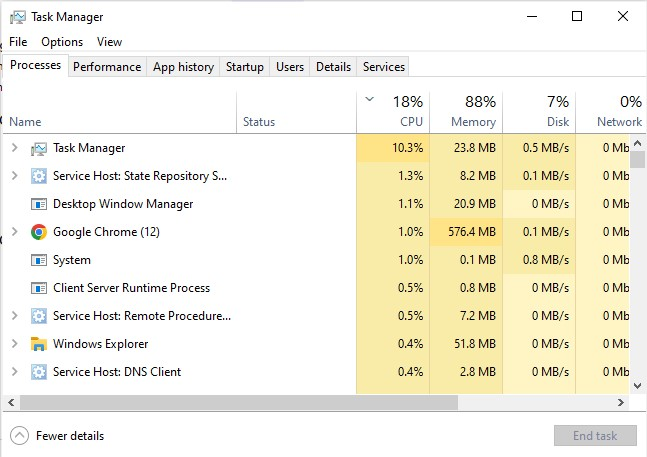
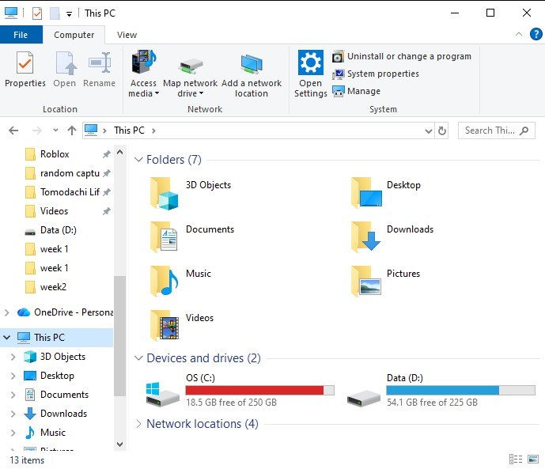
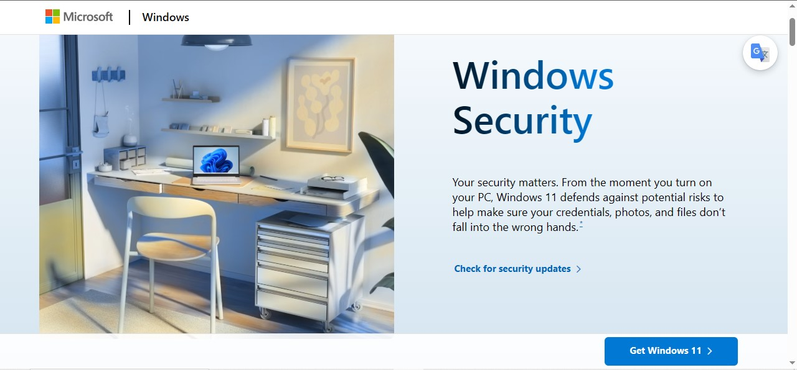

### Linux (Command)
1. top, ps
2. free, swap
3. ext4 + chmod
4. lsusb, lspci
5. sudo + permission system

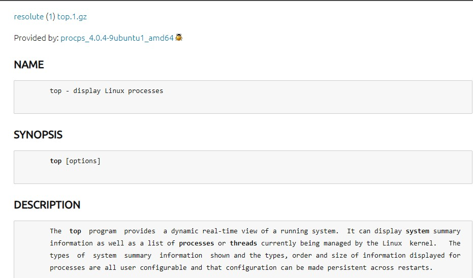
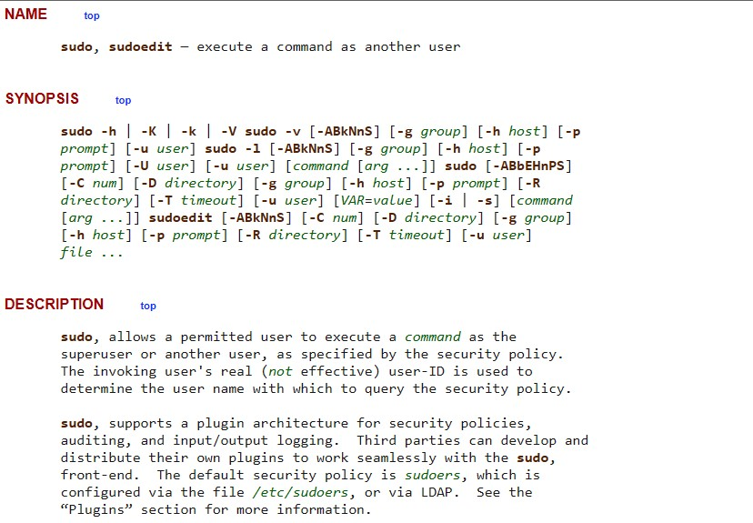

---

## Latihan 1.2
Kapan sebaiknya menggunakan Windows vs Linux vs macOS? Analisis berdasarkan use case: gaming, development, server, creative work, dan enterprise.

### A. Gaming
- **Windows:** Memainkan game dengan stabil dan kompatibel
- **Linux:** Game opensource/indie
- **macOS:** Hardware kurang untuk game

### B. Development
- **Windows:** .Net dan GameDev
- **Linux:** Banyak support terhadap Linux
- **macOS:** Bisa Fullstack mirip Linux

### C. Server
- **Windows:** Enterprise Specific
- **Linux:** Mayoritas server dunia pakai Linux
- **macOS:** Jarang digunakan untuk server production

### D. Creative Work
- **Windows:** GPU high-end support, banyak software profesional
- **Linux:** Ada, namun kurang
- **macOS:** Optimasi hardware-software Apple & aplikasi premium

### E. Enterprise
- **Windows:** Pilihan umum
- **Linux:** Murah, better for Dev
- **macOS:** Bagus untuk Startup

---

## Latihan 1.3
Install Ubuntu Server 22.04 LTS di VirtualBox dengan langkah berikut:

1. Download Ubuntu Server ISO dari website resmi
2. Create VM baru di VirtualBox (RAM: 2GB, Disk: 25GB)
3. Install dengan automatic partitioning (guided)
4. Buat user account dengan password yang kuat
5. Reboot dan login ke sistem
6. Dokumentasikan proses instalasi dengan screenshot key steps

### Installation Steps

**1. Opening VM**
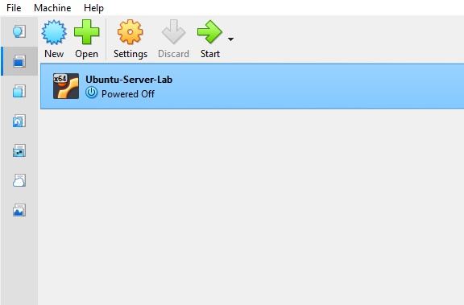

**2. New VM and Mounting Linux ISO**
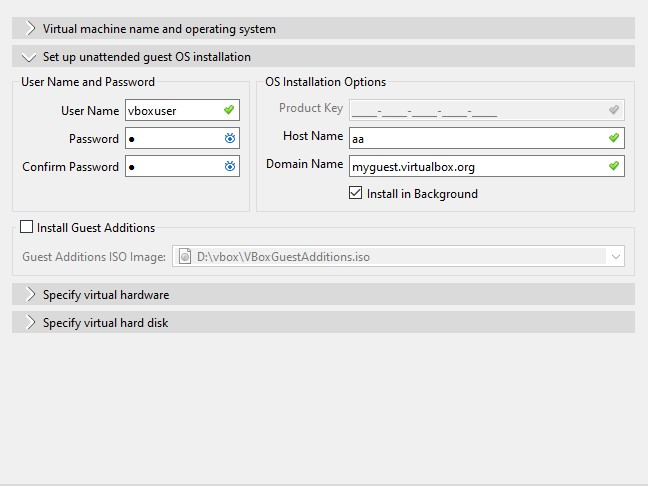

**3. After Install Linux and Making New Account**
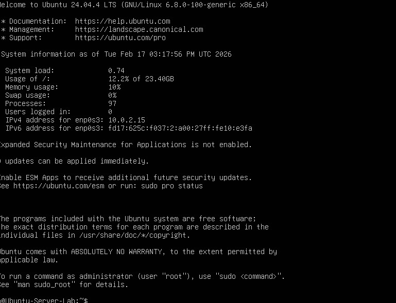

---

## Latihan 1.4
Setelah instalasi Ubuntu Server, lakukan tasks berikut:

1. Update package list: `sudo apt update`
2. Upgrade packages: `sudo apt upgrade`
3. Install neofetch: `sudo apt install neofetch`
4. Jalankan neofetch dan screenshot hasilnya
5. Check disk usage dengan `df -h`
6. Check memory dengan `free -h`
7. Dokumentasikan output dari setiap command

### Command Output

**1. Update All**
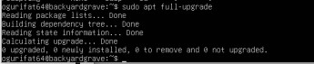

**2. NeoFetch**
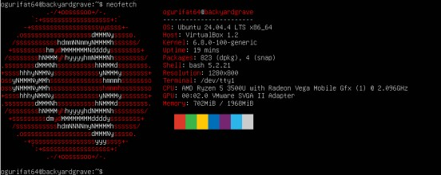

**3. Disk Usage (df -h)**
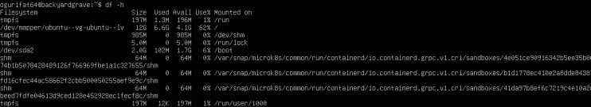

**4. Memory Usage (free -h)**
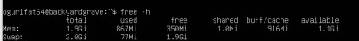

---

## Latihan 1.5
Eksplorasi sistem yang baru diinstall:

1. Tampilkan informasi OS: `cat /etc/os-release`
2. Tampilkan versi kernel: `uname -r`
3. List partisi: `lsblk`
4. Check network connectivity: `ping -c 4 google.com`
5. Install dan jalankan htop untuk melihat resource usage
6. Buat laporan singkat tentang konfigurasi sistem Anda

### System Information

**1. OS Release**
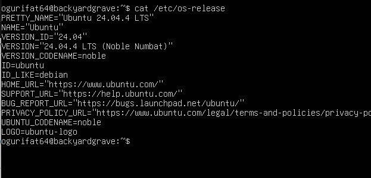

**2. Kernel Version**
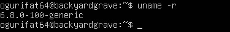

**3. Partition**
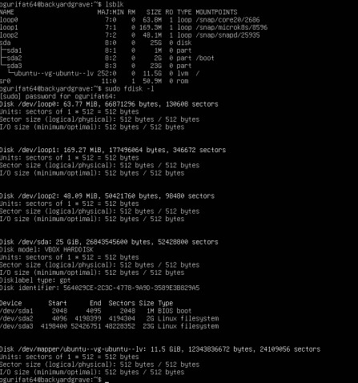

**4. Network Test**
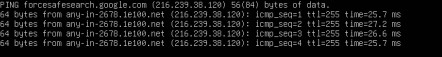

**5. Resource Monitor**
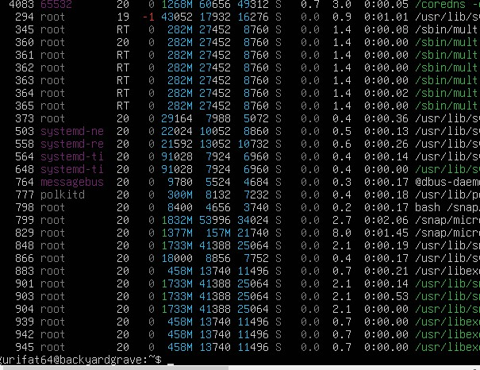

**6. Summary**
Sistem telah menggunakan versi terbaru, terhubung dengan internet, dan bekerja normal.

---

## Latihan 1.6
Ceritakan pengalaman Anda dengan sistem operasi:

### Refleksi Pengalaman

**1. Sistem Operasi Sehari-hari:**  
Saya sering menggunakan Operating System Windows.

**2. Durasi Penggunaan:**  
Hampir seumur hidup.

**3. Kelebihan:**  
Banyak aplikasi yang lebih mendukung Windows OS.

**4. Tantangan:**  
Update Windows yang sering mengganggu.

**5. Pengalaman dengan OS Lain:**  
Linux, tepatnya Distro Linux Mint. Saya menggunakan Linux Mint saat mencoba menghidupkan kembali komputer tua saya. Linux Mint dan Windows hampir mirip, namun di Linux Mint kebanyakan harus menggunakan aplikasi eksternal seperti Wine atau melakukan download via command.

**6. Sistem Operasi untuk Dicoba:**  
Mungkin saya akan menunggu ketersediaan support aplikasi dari distro OS Linux, karena penggunaan hardware yang terkadang sangat minim dari OS tersebut, menjadi alternatif saya ketika OS Windows mendapatkan update besar—yang membuat banyak komputer dan laptop dengan spesifikasi ketinggalan zaman. Ini juga bisa menghemat biaya dari pemalakan key Windows yang mengganggu serta update yang kini membahayakan pengguna karena bug-bug yang diluar kendali orang awam. Berikut adalah pilihan saya jika ingin bermain game menggunakan distro Linux:

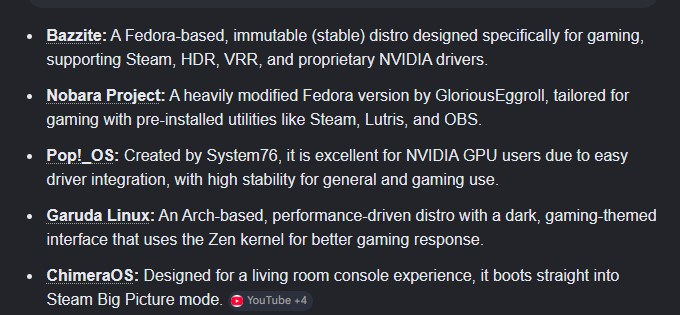

