## NAMA : AVEROSE ARTHUR RAHMAN // TI-1H / 04
## REPORT WEEK 10 OS

## PRAKTIKUM 1
lakukan free -h

1. 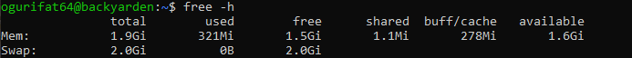 

cat / proc / meminfo | head -n 20

2. 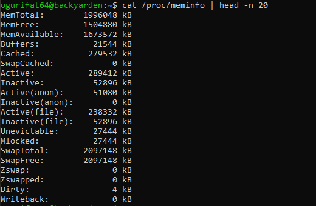 

3. 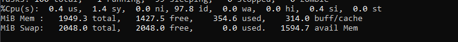

4. 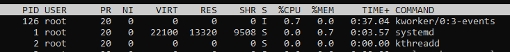

## STUDI KASUS 1
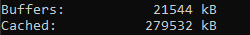

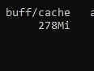

1. Hitung persentase memori tersedia: available / total × 100%. Jika hasilnya
di bawah 10%, sistem mulai kekurangan memori. 

1.6/1.9 X 100% = 84.2%

2. Pada baris Swap, apakah kolom used bernilai 0? Jika lebih dari 0, kernel sudah
pernah memindahkan data ke disk karena RAM tidak cukup.

KOLOM SWAP ADALAH NOL

3. Perhatikan field Cached dan Buffers di /proc/meminfo. Nilai ini sesuai
dengan kolom buff/cache pada free -h.

Sudah sesuai

## PRAKTIKUM 2
Analisa dari hasil vm stat 1 5

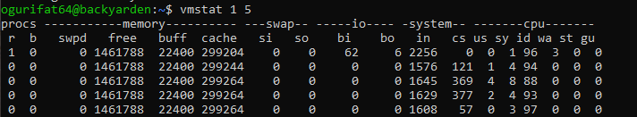

1. Amati nilai si dan so pada kelima baris. Pada sistem normal dengan RAM
cukup, kedua nilai ini selalu 0.

2. Jika nilai si atau so sesekali muncul lebih dari 0, artinya pernah ada aktivitas
swap. Ini masih wajar jika tidak terus-menerus.

belum pernah ada aktivitas

3. Jika si dan so terus-menerus lebih dari 0, sistem dalam kondisi memory
pressure serius — performa turun drastis karena akses disk jauh lebih lambat
dari RAM.

performa stabil

4. Perhatikan juga kolom free (RAM kosong) dan buff (buffer) untuk memahami
kondisi keseluruhan RAM saat itu.

ram dalam kinerja yang ringan

## PRAKTIKUM 3
Swap Space

Langkah 1: Buat file berukuran 512 MB sebagai calon swap.

Langkah 2: Atur permission file menjadi 600 — hanya root yang boleh membaca
dan menulis.
 
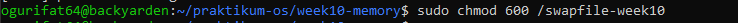 

Langkah 3: Format file sebagai area swap, lalu aktifkan.

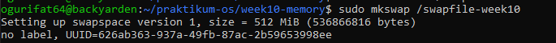 

Langkah 4: Verifikasi swap aktif. Anda akan melihat entri /swapfile-week10
dengan ukuran 512M, dan nilai total pada baris Swap di free -h bertambah 512M.

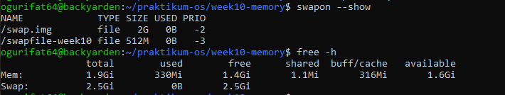

Langkah 5: Periksa nilai swappiness, ubah sementara, dan verifikasi perubahan.
cat / proc / sys / vm / swappiness
sudo sysctl vm . swappiness =10
cat / proc / sys / vm / swappiness

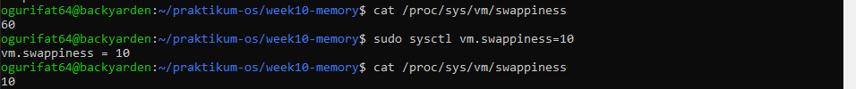

analisis
1. Berapa nilai swappiness default? Apa artinya bagi perilaku kernel dalam
menggunakan swap?
 nilai default Linux (60).
2. Setelah diubah ke 10, konfirmasi nilai berubah pada output cat kedua. Apa
dampak nilai 10 terhadap penggunaan swap dibanding nilai 60?
: kernel lebih mengutamakan RAM dan hanya menggunakan swap jika benar-benar terpaksa
3. Apakah entri /swapfile-week10 muncul di swapon –show? Jika tidak,
pastikan Langkah 2 (chmod 600) sudah dijalankan sebelum Langkah 3.
muncul

## PRAKTIKUM 4 Monitoring Memory
1. Ambil snapshot proses diurutkan dari penggunaan memori terbesar.

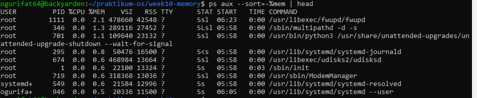

2. Pantau secara real-time dengan top.

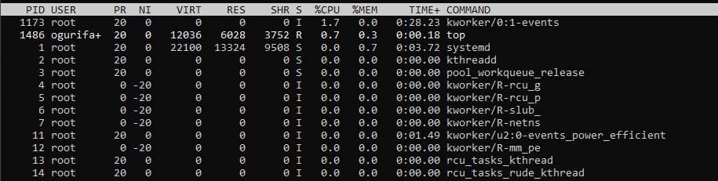

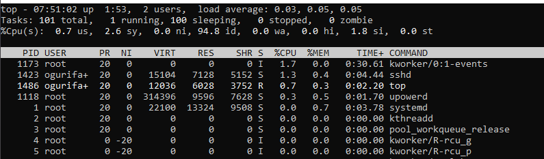

analisis
1. Proses apa yang berada di urutan pertama? Catat nilai %MEM dan RSS-nya.
root, mem 2.1, rss 42548
2. Konversikan RSS dari KB ke MB (bagi 1024). Misalnya, RSS=524288 berarti proses menggunakan 512 MB RAM. Apakah wajar untuk jenis program
tersebut?
42548 / 1024 = 41,5 mb, untuk pengunaan root sangat wajar

3. Mengapa VSZ selalu lebih besar dari RSS pada proses yang sama?
vsz menghitung memori yang dipesan
rss memori yang benar2 digunakan

4. Apakah urutan proses di ps konsisten dengan tampilan top saat diurutkan
berdasarkan %MEM?
tergantung proses yang ada

## PRAKTIKUM 5 Script Monitor Memori

isi script

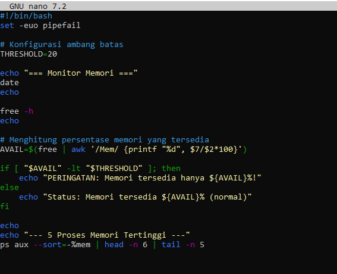 

izin script

run

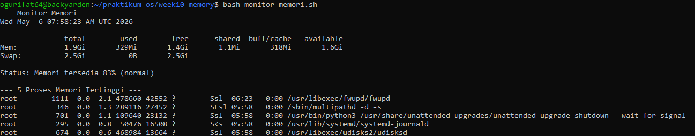

analisis    

1. Variabel THRESHOLD=20 menetapkan batas persentase. Perintah free | awk
’/Mem/ {printf "%d", $7/$2*100}’ mengambil kolom ke-7 (available) dibagi
kolom ke-2 (total) dari baris Mem, lalu dikalikan 100 untuk menghasilkan
persentase bilangan bulat.

$7 merepresentasikan kolom available (memori yang benar-benar siap digunakan oleh aplikasi baru) dan $2 adalah total memori fisik.
2. Kondisi if [ "$AVAIL" -lt "$THRESHOLD" ] bernilai benar jika persentase
memori tersedia di bawah 20.
Jika memori yang tersedia (misal: 15%) lebih kecil dari ambang batas (20%), maka skrip akan memicu blok then yang berisi pesan PERINGATAN.

3. Ubah THRESHOLD menjadi 90 dan jalankan ulang. Apa yang berubah pada
output? Mengapa demikian

output akan berubah dari status "normal" menjadi "PERINGATAN"., Dengan batas 90%, skrip sekarang menganggap sistem "dalam bahaya" jika memori yang tersedia di bawah 90%.

## STUDI KASUS 10.2
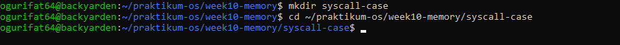

 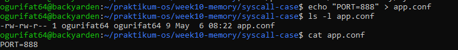
 
  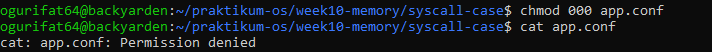
  
   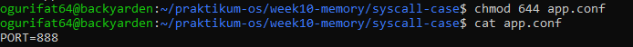

   analisis
   Analisis:
1. Mengapa cat menghasilkan Permission denied setelah chmod 000? System
call apa yang gagal?

Perintah chmod 000 menghapus seluruh izin akses (baca, tulis, eksekusi) dari file tersebut.

2. Apa perbedaan pesan error Permission denied vs No such file or directory?
Permission Denied Filenya ada di dalam sistem, tetapi pengguna atau program tidak memiliki izin yang cukup untuk mengaksesnya.
No such file or directory, file tidak ada / salah penempatan, atau pencarian nama files

3. Permission 644 berarti apa untuk owner, group, dan others?   
6 merepresentasikan owner

4 represent group

4 others

## PRAKTIKUM 6

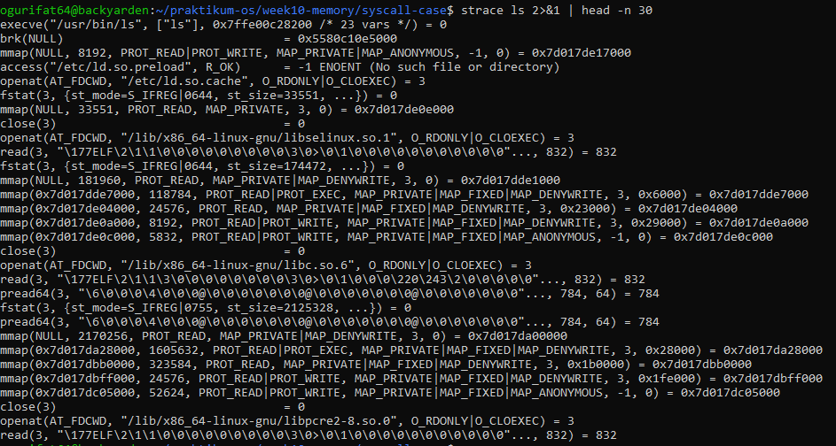 

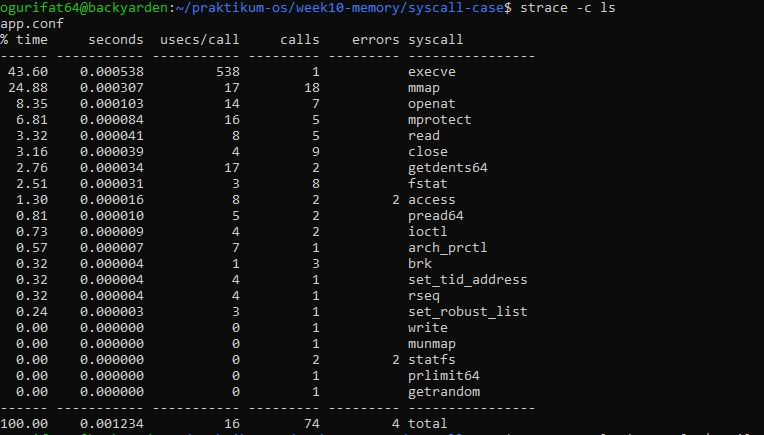 

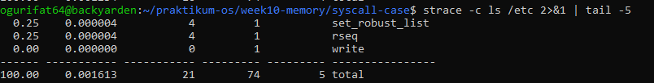

ANALISIS

1. Dari output Langkah 1, identifikasi minimal 4 system call berbeda. Jelaskan
fungsi singkat masing-masing berdasarkan argumen yang terlihat.

execve: Digunakan untuk mengeksekusi program (dalam hal ini /usr/bin/ls). Argumennya menunjukkan jalur file yang dijalankan dan argumen baris perintahnya.

openat: Digunakan untuk membuka file atau direktori. Terlihat argumen seperti /etc/ld.so.cache dengan flag O_RDONLY (hanya baca).

mmap: Digunakan untuk memetakan file atau perangkat ke dalam memori. Ini sering terlihat setelah openat untuk memuat pustaka (library) bersama ke dalam ruang memori proses.

fstat: Digunakan untuk mendapatkan status atau informasi detail dari sebuah file (seperti ukuran file atau izin akses) berdasarkan file descriptor yang sedang terbuka.

2. Dari ringkasan strace -c, system call mana yang paling sering dipanggil?
Mengapa?
mmap adalah yang paling sering dipanggil dengan total 18 kali.
Karena setiap kali perintah ls dijalankan, sistem perlu memuat berbagai pustaka standar (seperti libc.so, libselinux.so, dll) ke dalam memori.

3. Apakah ada system call dengan errors lebih dari 0? Apakah itu berarti
program bermasalah, ataukah bagian normal dari logika program?

ada dua system call yang menunjukkan error pada kolom errors: access (2 error) dan statfs (2 error).
Program sering kali "mencoba" mencari file konfigurasi atau pustaka di beberapa lokasi standar. Contohnya pada gambar pertama, access("/etc/ld.so.preload", R_OK) menghasilkan -1 ENOENT (No such file or directory). Ini adalah cara standar bagi pemuat sistem (system loader) untuk mengecek keberadaan file opsional sebelum melanjutkan proses.

4. Apakah jumlah system call berbeda antara ls dan ls /etc? Faktor apa yang
menyebabkan perbedaan tersebut?

umlah total panggilan (calls) terlihat sama, yaitu 74. Namun, total waktu yang dihabiskan (seconds) berbeda (0.001234 vs 0.001613).

Faktor Penyebab Perbedaan: Secara teori, jika direktori /etc memiliki jumlah file yang jauh lebih banyak daripada direktori saat ini, jumlah panggilan getdents64 (untuk membaca entri direktori) atau stat mungkin akan bertambah.

## TUGAS

## tugas 1

 

 Analisis
1. Hitung persentase memori tersedia (available / total × 100%). Apakah
sistem dalam kondisi normal?
1.6/1.9 X 100% = 84.2%, ya pengunaan dasar

2. Mengapa buff/cache tidak dihitung sebagai memori yang terpakai dari sudut
pandang ketersediaan untuk aplikasi?
Sifat Reclaimable: Buffer dan cache berisi data yang disimpan sementara oleh kernel untuk mempercepat akses I/O.

Prioritas Aplikasi: Jika sebuah aplikasi baru membutuhkan memori secara mendadak, kernel dapat langsung mengosongkan (evict) data pada buff/cache tersebut dan memberikannya kepada aplikasi tanpa mengganggu jalannya sistem. Oleh karena itu, kolom available menyertakan sebagian besar nilai buff/cache sebagai potensi memori yang siap digunakan.

3. Dari /proc/meminfo, apakah SwapTotal lebih besar dari 0? Berapa nilai
SwapFree? 
SwapTotal: Nilainya adalah 2,097,148 kB, yang berarti nilainya lebih besar dari 0. Ini menunjukkan bahwa sistem memiliki ruang swap yang terkonfigurasi sebesar kurang lebih 2 GiB.

SwapFree: Nilainya adalah 2,097,148 kB. Hal ini menunjukkan bahwa saat ini tidak ada memori swap yang sedang digunakan (0% penggunaan), yang konsisten dengan pembacaan Swap: 0B pada ringkasan free -h.

## tugas 2

Analisis
1. Proses apa di urutan pertama? Catat nilai %MEM dan RSS.
Proses yang menggunakan memori tertinggi di urutan pertama adalah:
COMMAND: /sbin/multipathd -d -s.

2. Konversikan RSS ke MB (bagi 1024). Apakah wajar?
$27452 / 1024 = 26.81 MB., wajar
3. Jumlahkan %MEM dari 5 proses teratas. Berapa persen RAM yang mereka
gunakan bersama? 

1. multipathd 1.3%
2. python3 (unattended-upgrades): 1.1%
3. systemd-journald: 0.8%
4. udisksd: 0.6%
5. init: 0.6%

Total Penggunaan Bersama: $1.3 + 1.1 + 0.8 + 0.6 + 0.6 = 4.4%

## tugas 3

 

Analisis
1. Identifikasi kolom NAME, TYPE, SIZE, dan USED pada output swapon –show.

NAME: /swapfile-tugas-week10

TYPE: file 

SIZE: 256M

USED: 0B 

2. Apakah nilai total pada baris Swap di free -h bertambah 256 MB?
Ya, nilai total swap bertambah., menjalankan swapon untuk file baru sebesar 256M, total swap pada baris Swap di perintah free -h menjadi 2.2Gi. Ini menunjukkan penggabungan kapasitas antara swap lama dan swap baru yang baru saja diaktifkan
3. Mengapa permission 600 penting? Apa risiko jika diatur ke 644? 
Permission 600 (read & write hanya untuk pemilik/root) sangat krusial karena file swap berisi salinan data langsung dari RAM. Data sensitif seperti kata sandi, kunci enkripsi, atau data pribadi yang sedang diproses aplikasi bisa tersimpan di sini dalam bentuk teks biasa.

Jika diatur ke 644, pengguna lain di sistem (grup dan others) memiliki izin untuk membaca file swap tersebut. Hal ini menciptakan celah keamanan yang serius di mana pengguna biasa dapat mengintip isi memori sistem dan mencuri informasi sensitif milik pengguna lain atau proses sistem. kernel Linux bahkan akan memberikan peringatan keamanan jika file swap memiliki izin akses yang terlalu terbuka.

## tugas 4

Analisis
1. Sebutkan minimal 5 system call dari strace-summary.txt beserta fungsi
singkatnya.
mmap, memetakan lokasi file
openat membuka file/direktori (file descriptor)
read, baca data file dari file desc
write, menulis data
getdents64: Berfungsi untuk mengambil entri direktori

2. System call mana yang paling sering dipanggil? Mengapa?

Setiap kali sebuah program (seperti ls) dijalankan, sistem perlu memetakan berbagai pustaka bersama (shared libraries) dan alokasi memori awal ke dalam ruang alamat proses agar program dapat berfungsi.

3. Apakah ada errors lebih dari 0? Apakah program tetap berjalan normal
meskipun ada kegagalan tersebut?

terdapat total 4 errors (2 pada statfs dan 2 pada access).
Ya, program tetap berjalan normal.

merupakan bagian normal dari logika program. Misalnya, system call access sering kali menghasilkan error jika program mencoba mencari file konfigurasi di lokasi tertentu yang memang tidak ada sebelum mencoba lokasi lainnya. Ini bukan berarti program rusak, melainkan cara program memeriksa keberadaan atau izin suatu file.

## tugas 5

 

analisis
1. Jelaskan peran masing-masing fungsi: cek_memori, cek_swap, cek_proses,
cek_paging, dan ringkasan. Mengapa diagnosa dipecah menjadi fungsi
terpisah?

cek_memori: Menampilkan statistik RAM menggunakan free -h dan menghitung persentase memori yang tersedia.
cek_swap: Memeriksa apakah ada partisi atau file swap yang aktif dan menghitung berapa banyak kapasitas swap yang sedang digunakan.

cek_proses: Mengidentifikasi 10 proses yang paling banyak mengonsumsi memori agar administrator tahu aplikasi mana yang membebani sistem.

cek_paging: Mengambil sampel aktivitas sistem (I/O, memori, CPU) menggunakan vmstat untuk melihat apakah terjadi antrean data antara RAM dan disk.

ringkasan: Mengumpulkan hasil evaluasi dari fungsi-fungsi sebelumnya dan menyajikannya dalam format yang ringkas dan mudah dibaca untuk pengambilan keputusan cepat.

2. Berdasarkan bagian RINGKASAN, apakah kondisi sistem normal atau kritis?
Jelaskan berdasarkan nilai threshold yang digunakan script.

Memori: Kondisi dianggap Normal jika memori yang tersedia (AVAIL_PCT) adalah 20% atau lebih. Kondisi menjadi Kritis jika memori tersedia di bawah 20%.

Swap: Kondisi dianggap Normal jika penggunaan swap adalah 0 kB. Jika nilai swap yang digunakan lebih dari 0, skrip akan memberikan info bahwa swap aktif, yang menandakan RAM fisik sudah mulai penuh.

3. Mengapa script menggunakan tee "$LAPORAN" bukan redirection biasa >
"$LAPORAN"? Apa keuntungannya?

Output ke Terminal: Hasil diagnosa tetap ditampilkan secara langsung di layar terminal agar pengguna bisa melihatnya saat itu juga.

Simpan ke File: Di saat yang bersamaan, hasil tersebut dialirkan ke dalam file $LAPORAN.

4. Dari output cek_paging, apakah ada aktivitas si atau so? Jika ada, apa
implikasinya terhadap performa server? 

Jika nilai si atau so secara konsisten di atas 0, ini menandakan terjadinya thrashing.

Dampak: Performa server akan menurun drastis (lambat/lag) karena kecepatan akses disk jauh lebih lambat daripada kecepatan RAM fisik. Ini adalah indikator terkuat bahwa server memerlukan tambahan RAM fisik.