## Nama : Averose Arthur Rahman
## Kelas TI-1H / 04

## PRAKTIKUM 1

1. 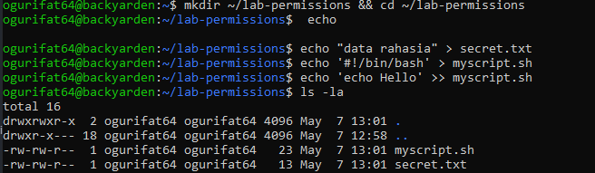 

2. 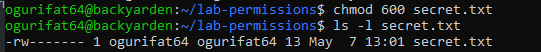 

3. 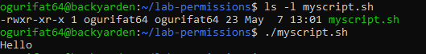 

4. 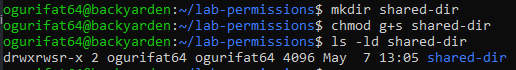 

5. 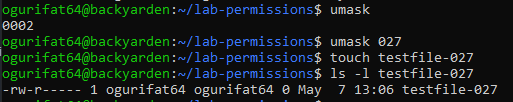

## Analisis
1. Mengapa secret.txt tidak dapat dibaca oleh group dan others setelah chmod 600?
Dalam sistem oktal Linux, angka 600 merepresentasikan:

6 (Pemilik): Baca (4) + Tulis (2) = 6.

0 (Grup): Tidak ada akses sama sekali.

0 (Others): Tidak ada akses sama sekali.
Jadi, perintah tersebut secara eksplisit menghapus semua hak akses untuk siapa pun kecuali si pemilik file.

2. Apa perbedaan arti 600 dan 755 terhadap file yang diuji?
600 (Private): Digunakan untuk data sensitif. Pemilik bisa baca/tulis (rw-), tapi orang lain tidak bisa melihat isinya sama sekali.

755 (Public/Executable): Pemilik punya kontrol penuh (rwx - baca/tulis/eksekusi). Grup dan orang lain hanya bisa baca dan menjalankan (r-x), tapi tidak bisa mengubah isi file tersebut. Ini adalah standar untuk file program atau skrip.

3. Setelah umask 027, permission apa yang dihasilkan untuk file baru, dan mengapa bukan 777?
Hasilnya: File baru biasanya akan memiliki permission 640 (atau rw-r-----).

Alasannya: Linux memiliki "base permission" default untuk file yaitu 666 (karena file baru biasanya tidak langsung diberi izin eksekusi demi keamanan). Perhitungannya adalah:
666 (Base) - 027 (Umask) = 640.
Umask berfungsi sebagai "penyaring" atau pengurang. Jadi, angka 027 melarang akses apa pun bagi "others" (angka 7 di akhir) dan membatasi akses tulis bagi "group" (angka 2 di tengah).
## Tantangan

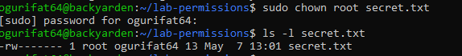

## PRAKTIKUM 2

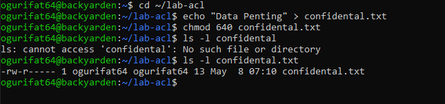 

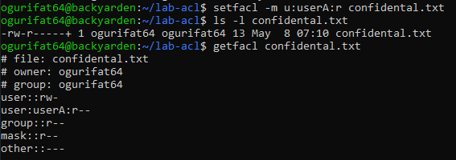 

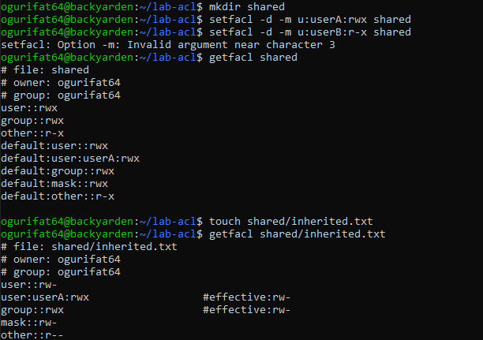

## Analisis
Analisis

1. Mengapa getfacl confidential.txt awalnya tidak menampilkan user tertentu?

Karena pada kondisi awal, file tersebut hanya memiliki izin standar Linux (UGO - User, Group, Others). Izin standar hanya mengenali satu pemilik (owner) dan satu grup pemilik. Sebelum perintah setfacl dijalankan, tidak ada entri ACL tambahan yang dikonfigurasi untuk user spesifik lainnya.

2. Setelah setfacl -m u:userA:r confidential.txt, apa perbedaan output ls -l dan getfacl?

ls -l: Muncul tanda tambah (+) di akhir deretan izin (misalnya -rw-r-----+), yang menandakan bahwa file tersebut kini memiliki Extended ACL.

getfacl: Menampilkan detail yang lebih spesifik, yaitu entri baru user:userA:r-- yang memberikan hak akses baca kepada userA tanpa mengubah grup utama file tersebut.

3. Mengapa file inherited.txt mewarisi ACL dari direktori shared?

Karena pada direktori shared telah dipasang Default ACL (menggunakan parameter -d pada perintah setfacl). Default ACL berfungsi sebagai "templat" izin yang secara otomatis akan diterapkan kepada setiap file atau sub-direktori baru yang dibuat di dalam direktori tersebut.
## Tantangan

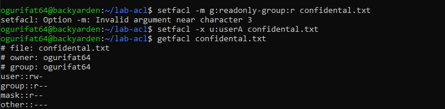

## PRAKTIKUM 3 a

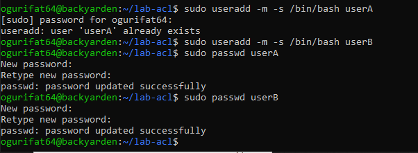 

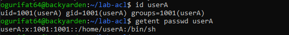 

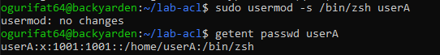 

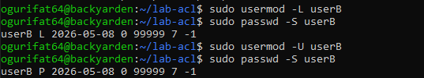

## Pertanyaan
1. Apa perbedaan output id userA sebelum dan sesudah menambah group?

Sebelum menambah group: Output akan menampilkan UID (User ID) dari userA, GID (Group ID) utama yang biasanya sama dengan nama user tersebut (misal: 1001(userA)), dan daftar groups yang hanya berisi satu grup utama tersebut.

Sesudah menambah group: (Misalnya menggunakan perintah sudo usermod -aG sudo userA), pada kolom groups akan muncul tambahan ID dan nama grup baru tersebut (misal: 27(sudo)). UID dan GID utama user tidak akan berubah.

2. Bagaimana status passwd -S userB berubah saat akun di-lock?

Saat akun aktif (normal): Status biasanya menampilkan kode P (Password set/usable) atau PS.

Saat akun di-lock (usermod -L): Status akan berubah menjadi L (Locked). Secara teknis, sistem menambahkan tanda seru (!) di depan password terenkripsi pada file /etc/shadow, sehingga user tidak bisa login menggunakan password tersebut sampai di-unlock kembali dengan parameter -U.

## PRAKTIKUM 3 b

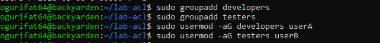 

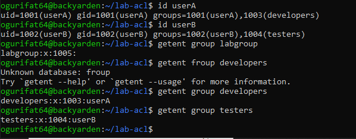

## Analisis
1. Apa yang ditampilkan id userA vs groups userA?
id userA: Menampilkan informasi yang sangat detail, mencakup UID (User ID), GID (Group ID utama), dan daftar semua groups (ID dan nama) di mana user tersebut bergabung.

groups userA: Hanya menampilkan nama-nama grup saja dalam satu baris teks sederhana. Perintah ini lebih mudah dibaca manusia jika Anda hanya ingin tahu daftar keanggotaannya saja.

2. Mengapa -a pada usermod -aG penting?
Opsi -a berarti Append (menambahkan).

Jika pakai -aG: User akan ditambahkan ke grup baru tanpa menghapus keanggotaan mereka di grup-grup yang sudah ada sebelumnya.

Jika hanya pakai -G (tanpa -a): Bahaya! Perintah ini akan menghapus user dari semua grup lama mereka dan hanya menyisakan grup yang baru saja disebutkan. Ini bisa menyebabkan user kehilangan akses penting (seperti akses sudo).

## PRAKTIKUM 3 c

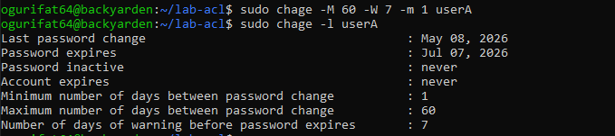 

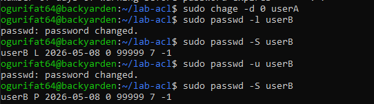

## Analisis
1. Apa arti nilai yang ditampilkan chage -l userA?
Perintah ini menampilkan detail kebijakan masa berlaku password (Password Aging). Nilai-nilai pentingnya meliputi:

Last password change: Tanggal terakhir password diubah.

Password expires: Tanggal kapan password akan kedaluwarsa.

Password inactive: Masa tenggang setelah kedaluwarsa sebelum akun dinonaktifkan sepenuhnya.

Minimum/Maximum number of days between password change: Jarak waktu minimum dan maksimum antar penggantian password.

Number of days of warning before password expires: Berapa hari sebelumnya sistem akan memberikan peringatan sebelum password basi.

2. Bagaimana cara membuktikan userB terkunci dari output passwd -S?
Lihat pada kolom kedua setelah nama user:

Jika akun terkunci, output akan menampilkan kode L (Locked).

Jika akun aktif, output akan menampilkan kode P (Password set) atau PS.
Secara teknis, perintah passwd -l menambahkan tanda seru (!) di depan hash password pada file /etc/shadow, sehingga tidak ada input password yang cocok.

3. Kapan sebaiknya menggunakan chage -d 0 vs passwd -e?
Secara fungsional, keduanya seringkali memberikan hasil yang sama, yaitu memaksa user mengganti password saat login berikutnya.

chage -d 0: Mengatur "tanggal penggantian password terakhir" menjadi 0 (Epoch, 1 Januari 1970). Ini adalah cara standar dalam skrip manajemen akun karena chage memang didedikasikan untuk kontrol penuaan (aging).

passwd -e: Singkatan dari expire. Ini lebih ringkas untuk digunakan secara manual jika Anda hanya ingin segera menghanguskan password saat ini tanpa memikirkan parameter tanggal spesifik.
## Tantangan

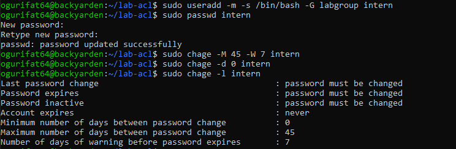

## PRAKTIKUM 4

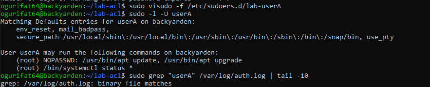

## Analisis
Analisis
1. Mengapa aturan disimpan di /etc/sudoers.d/, bukan langsung di /etc/sudoers? Menyimpan aturan di direktori /etc/sudoers.d/jauh lebih aman dan rapi (modular). Jika terjadi kesalahan sintaks pada satu file, file utama/etc/sudoers` tetap utuh sehingga admin tidak akan terkunci (locked out) dari sistem. Selain itu, ini mempermudah manajemen hak akses per user tanpa mengganggu konfigurasi global.

2. Mana perintah yang bisa dijalankan tanpa password, dan mana yang masih perlu autentikasi?

Tanpa Password (NOPASSWD): Perintah apt update dan apt upgrade. UserA bisa melakukan pembaruan paket tanpa diminta password root/user.

Perlu Autentikasi: Perintah systemctl status * (untuk mengecek status layanan). UserA bisa menjalankannya, tetapi sistem akan tetap meminta password userA untuk memverifikasi identitas.

3. Informasi apa saja yang dicatat di log sudo?
Log sudo (biasanya di /var/log/auth.log) mencatat:

Siapa yang menjalankan perintah.
Direktori kerja saat perintah dijalankan.
Perintah persis yang diketikkan.
Apakah perintah tersebut berhasil dijalankan atau ditolak karena masalah hak akses.

## Tantangan

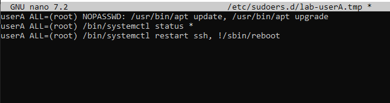

## PRAKTIKUM 5

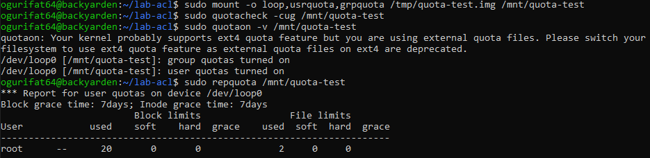 

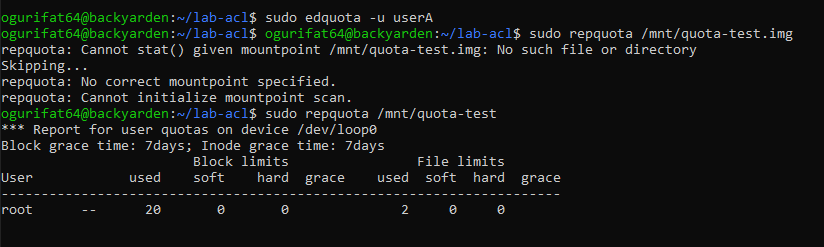 

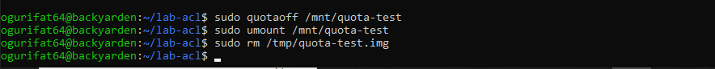

## Analisis
AnalisisApa fungsi dari perintah quotacheck -cug?Perintah ini berfungsi untuk memindai (scan) sistem file dan membuat file database quota baru yaitu aquota.user dan aquota.group di dalam direktori mount tersebut. Parameter -c (create) digunakan untuk membuat file baru, -u untuk user, dan -g untuk grup.Apa yang terjadi jika kita tidak menjalankan quotaon?Jika quotaon tidak dijalankan, batasan (limit) yang sudah kita atur menggunakan edquota tidak akan ditegakkan oleh sistem. User tetap bisa menulis data melebihi kapasitas karena kernel Linux belum "mengawasi" penggunaan disk pada partisi tersebut.Mengapa nilai yang dimasukkan di edquota berupa angka tanpa satuan (seperti 5120)?Karena sistem quota Linux menggunakan satuan block (umumnya 1 block = 1 KB). Jadi, jika kamu ingin mengatur batas 5 MB, perhitungannya adalah 5 x 1024 = 5120$.
## Tantangan

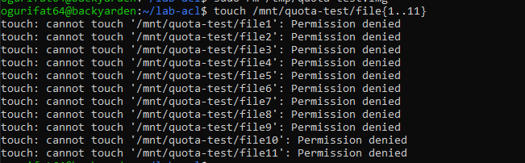

## LATTIHAN

## A Audit dan Kolaborasi
1. Temukan file SUID aktif dengan find / -perm -4000 -type f 2>/dev/null, lalu jelaskan
tiga file yang Anda kenali beserta alasannya.
2. Cari direktori world-writable dan tentukan mana yang valid dan mana yang berisiko.
3. Rancang konfigurasi permission standar dan ACL untuk direktori proyek /srv/webapp/ agar
group webapp-team dapat menulis, user deploy hanya membaca, dan file baru selalu mewarisi
group proyek.

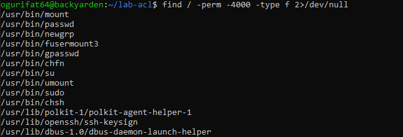 

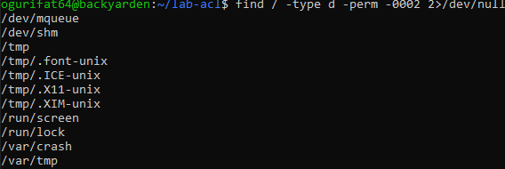 

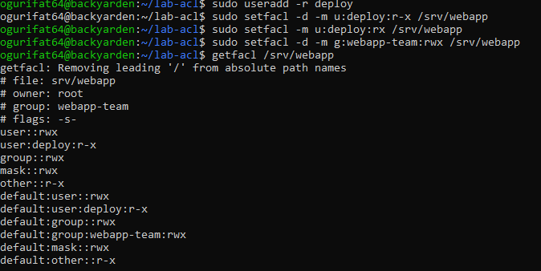

## B Kebijakan Akun dan Quota
Tuliskan langkah untuk membuat user intern, menambahkannya ke group labgroup, memaksa pergantian password tiap 45 hari (warning 7 hari), memberi izin sudo hanya untuk systemctl status, dan
menetapkan quota ruang serta inode sederhana pada /home/.

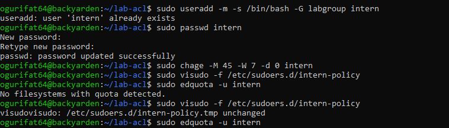

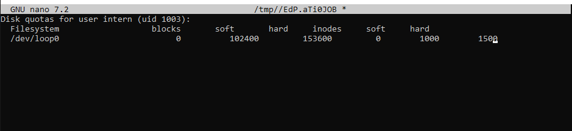