## NAMA : Averose Arthur R // Kelas : TI-1H/04
 **tugas pendahuluan**
 1. Perintah Dasar Direktori
pwd (Print Working Directory): Menampilkan jalur (path) lengkap dari direktori tempat Anda berada saat ini.
-
cd (Change Directory): Digunakan untuk berpindah dari satu direktori ke direktori lain.
-
mkdir (Make Directory): Digunakan untuk membuat direktori atau folder baru.
-
rmdir (Remove Directory): Digunakan untuk menghapus direktori yang kosong. Jika direktori berisi file, perintah ini akan gagal.

2. Manipulasi File
cp, Meng-Copy File/Directory (cp[sumber][tujuan])
-
mv Memindahkan atau mengubah nama file/directory
-
rm remove File/Directory

3. Perbedaan Hard Link vs Soft Link
Hard Link (Direct):

Merujuk langsung ke inode (data fisik) yang sama di hard drive.
Jika file asli dihapus, file hard link tetap bisa diakses karena datanya masih ada selama masih ada link yang mengarah ke sana.
Tidak bisa lintas partisi/sistem file.

Soft Link / Symbolic Link (Indirect):
Hanya berupa shortcut atau penunjuk jalan yang berisi alamat/jalur ke file asli.
Jika file asli dihapus, soft link akan rusak (broken link) karena alamat yang ditujunya sudah hilang.
Bisa digunakan lintas partisi atau direktori.


4. Perintah Pencarian dan Filter
file: Digunakan untuk melihat tipe file karena di Linux ekstensi file tidak selalu menentukan jenisnya.

find: Mencari file secara real-time di dalam hierarki direktori 

which: Menunjukkan lokasi file executable (aplikasi) yang dijalankan saat kita mengetik sebuah perintah di terminal.

locate: Mencari file dengan cepat menggunakan database indeks 

grep: Digunakan untuk mencari pola teks tertentu di dalam sebuah file atau dari hasil output perintah lain.

## Percobaan 1: Direktory
Langkah-langkah:
1. Melihat direktori HOME
```
pwd
echo $HOME
```
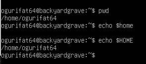

2. Melihat direktori aktual dan parent
```
pwd
cd .
pwd
cd ..
pwd
cd
```
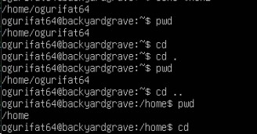

3. Membuat satu direktori, lebih dari satu direktori atau sub direktori
```
pwd
mkdir A B C A/D A/E B/F A/D/A
ls -l
ls -l A
ls -l A/D
```
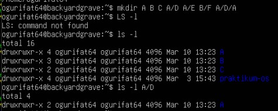

4. Menghapus satu atau lebih direktori hanya dapat dilakukan pada direktori kosong dan hanya dapat dihapus oleh pemiliknya kecuali bila diberikan ijin aksesnya
```
rmdir B
ls -l B
rmdir B/F B
ls -l B
```
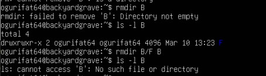
* Terjadi error saat rmdir B karena direktori B tidak kosong, tidak bisa dihapus
* Terjadi error saat ls -l B karena direktori B sudah dihapus sehingga tidak di-list

5. Navigasi direktori dengan instruksi cd untuk pindah dari satu direktori ke direktori lai
```
pwd
ls -l
cd A
pwd
cd ..
pwd
cd /home/ogurifat64/C
pwd
cd /ogurifat64/C
pwd
```
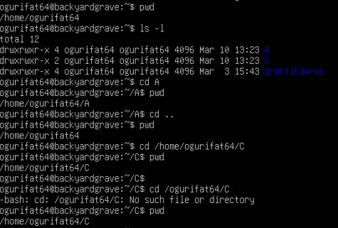
* Terjadi error karena alamat ditulis tidak lengkap, menggunakan ~


## Percobaan 2: Manipulasi File
1. Perintah cp untuk mengkopi file atau seluruh direktori
```
cat > contoh
Membuat sebuah file
[Cntrl-d]
ls -l
cp contoh A
ls -l A
cp contoh contoh1 A/D
ls -l A/D
```
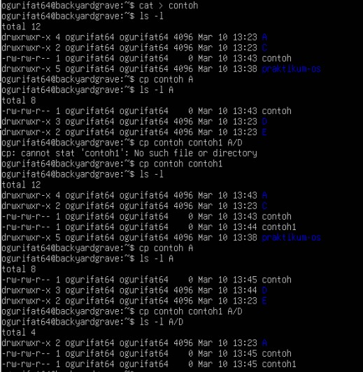

2. Perintah mv untuk memindah file
```
mv contoh contoh2
ls -l
mv contoh1 contoh2 A/D
ls -l A/D
mv contoh contoh1 C
ls -l C
```
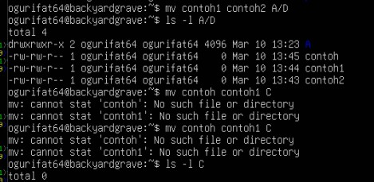

3. Perintah rm untuk menghapus file
```
rm contoh2
ls -l
rm -i contoh
rm -rf A C
ls -l
```
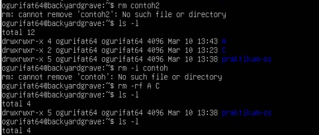


## Percobaan 3: Symbolic Link
```
echo "Hello apa khabar" > halo.txt
ls -l
ln halo.txt z
ls -l
cat z
mkdir mydir
ln z mydir/halo.juga
cat mydir/halo.juga
ln -s z bye.txt
ls -l bye.txt
cat bye.txt
```
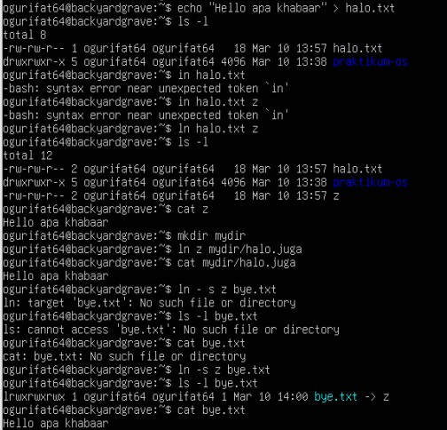


## Percobaan 4: Melihat Isi File
```
ls -l
file halo.txt
file bye.txt
```
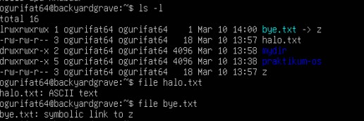


## Percobaan 5: Mencari File
1. Perintah find
```
find /home -name "*.txt" -print > myerror.txt
cat myerror.txt
find . -name "*.txt" -exec wc -l '{}' ';'
```
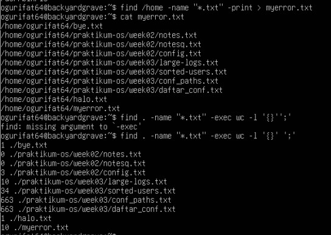

2. Perintah which
```
which ls
```
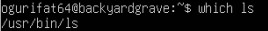

3. Perintah locate
```
locate "*.txt"
```
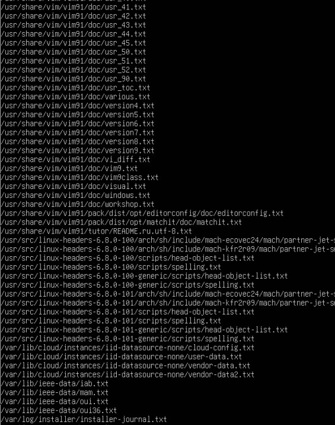


## Percobaan 6: Mencari text pada file
```
grep Hallo *.txt
```


## Latihan
1. Cobalah urutan perintah berikut:
```
cd
pwd
ls -al
cd .
pwd
cd ..
pwd
ls -al
cd ..
pwd
ls -al
cd /etc
ls -al | more
cat passwd
cd -
pwd
```

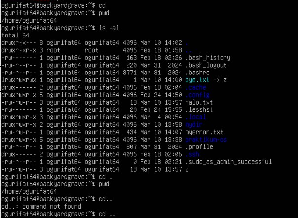 
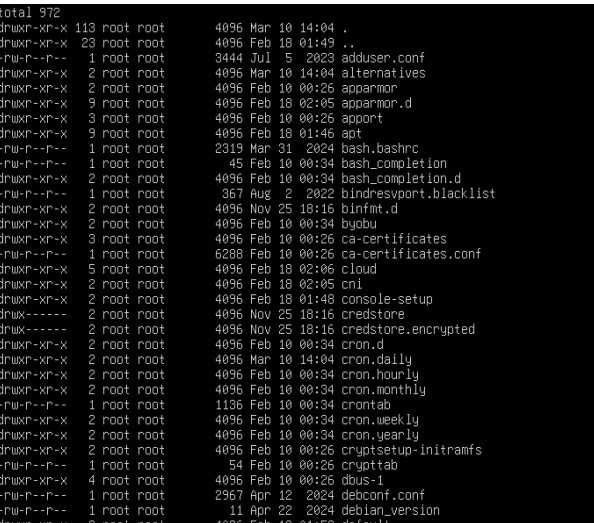 
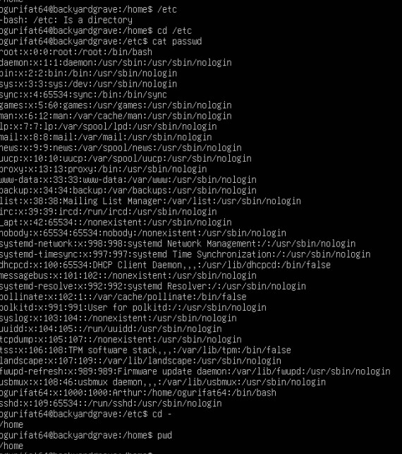


2. Lanjutkan penelusuran pohon pada sistem file menggunakan cd, ls, owd, dan cat. Telusuri direktory /bin, /usr/bin, /sbin, /tmp, dan /boot
/bin
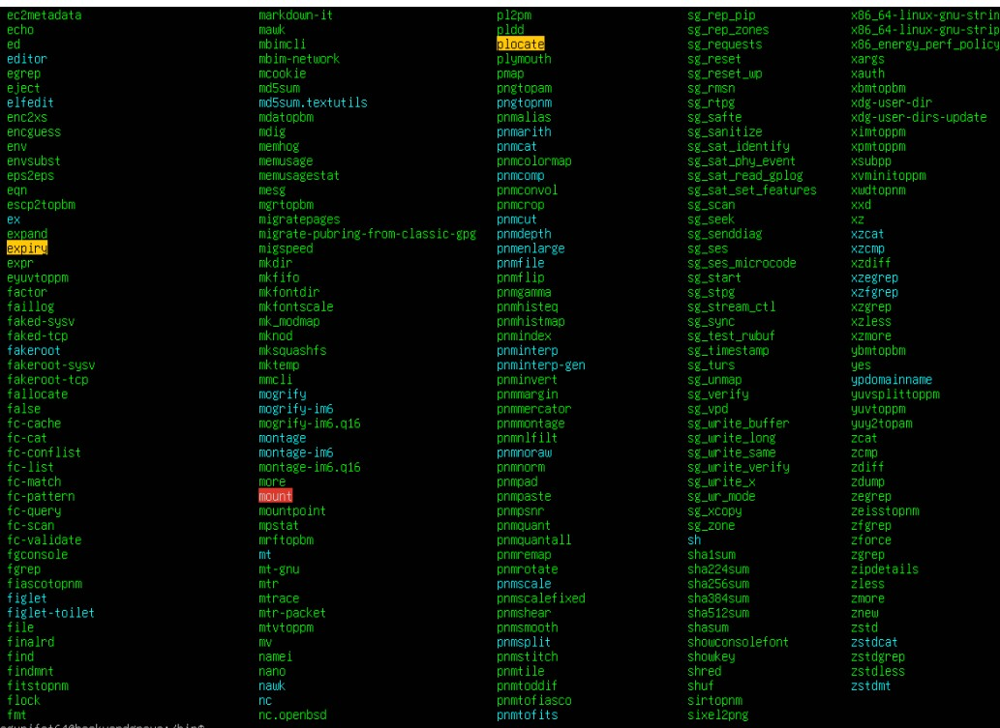
/sbin
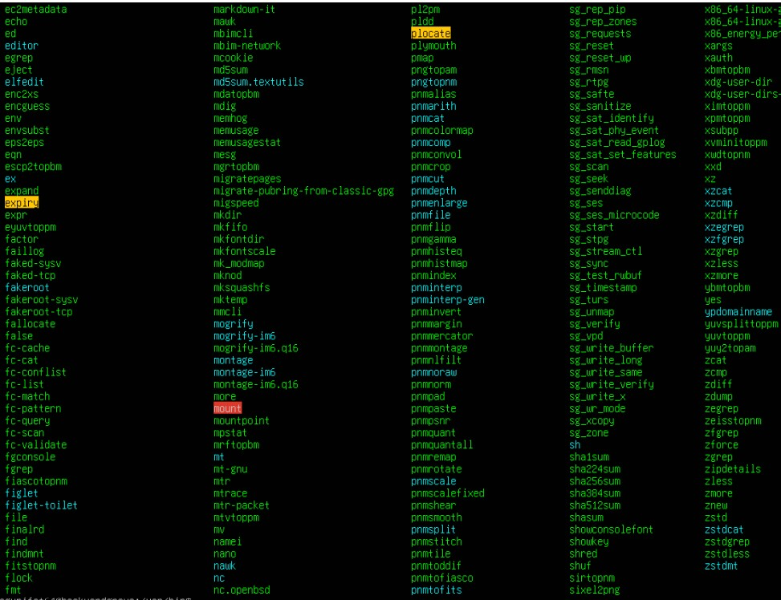 
/tmp
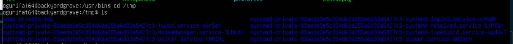 
/boot
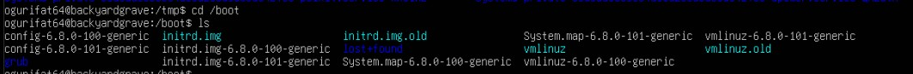


3. Telusuri direkoty /dev. Identifikasi perangkat yang tersedia. Identifikasi tty (terminal) Anda (ketik who am i); siapa pemilik tty Anda (gunakan ls -l)
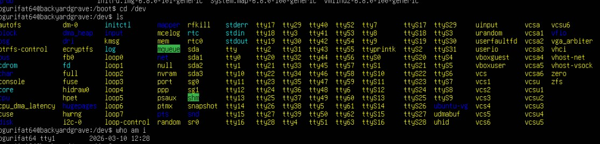


4. Telusuri directory /proc. Tampilkan isi file interrupts, devices, cpuinfo, meminfo dan uptime menggunakan perintah cat. Dapatkah anda melihat mengapa directory /proc disebut pseudo-filesystem yang memungkinkan akses ke struktu data kernel?
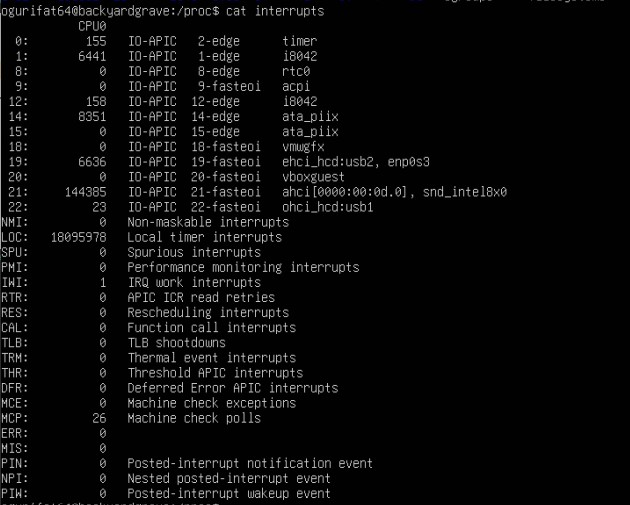 

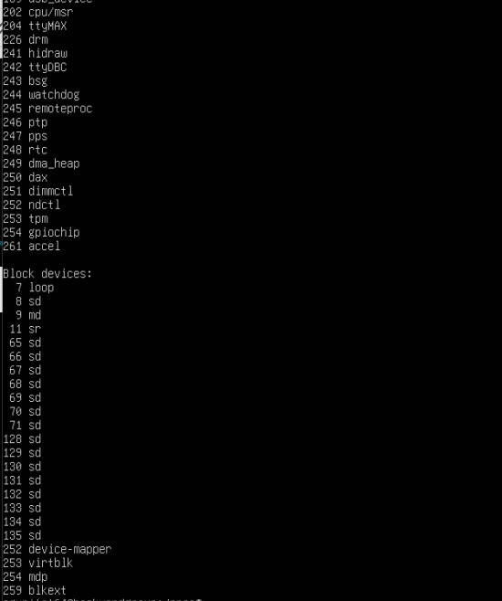

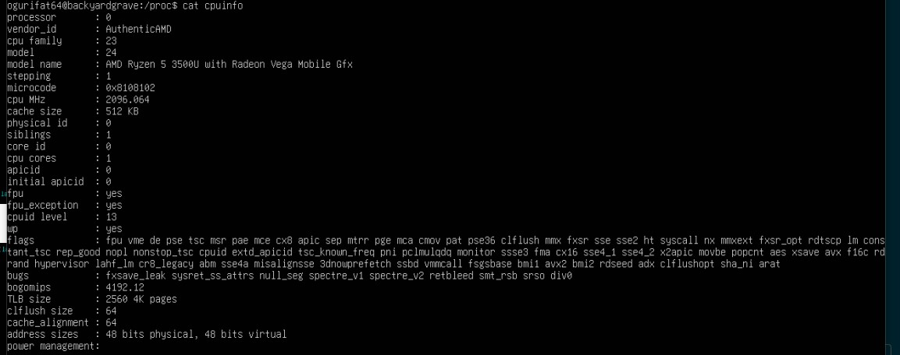 

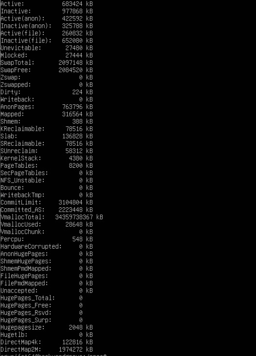 

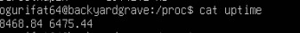
5. Ubahlah direktory home ke user lain secara langsung menggunakan cd ~username
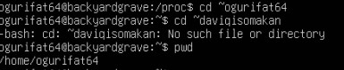

6. Ubah kembali ke directory home anda
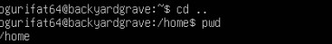
7. Buat subdirectory work dan play
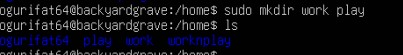
8. Hapus directory work

9. copy file /etc/passwd ke directory home anda

10. Pindahkan ke subdirectory play
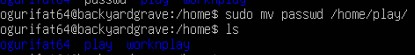
11. Ubahlah ke direktory play dan buat symbolic link dengan nama terminal yang menunjuk ke perangkat tty. Apa yang terjadi jika melakukan hard link ke perangkat tty?
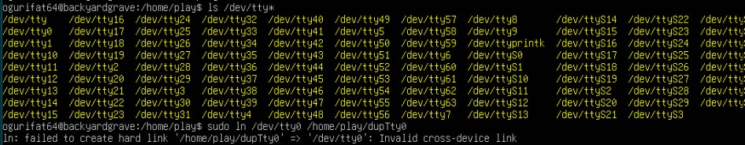
* terjadi error "Invalid cross-device link" jika melakukan hard link ke perangkat tty

12. Buatlah file bernama hello.txt yang berisi kata "hello world". Dapatkah anda gunakan "cp" menggunakan "terminal" sebagai file asal untuk menghasilkan efek yang sama
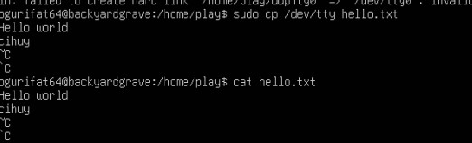
13. Copy hello.txt e terminal. Apa yang terjadi?
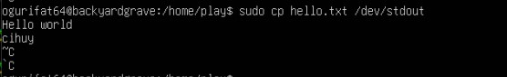
14. Masih direktory home, copy keseluruhan direktory ke direktory bernama menggunakan symbolic link.
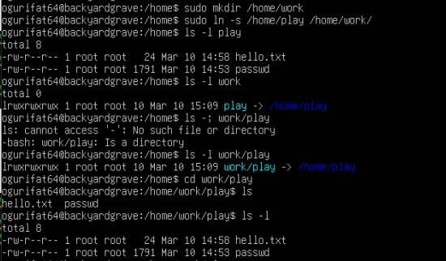
15. Hapus direktory work dan isinya dengan satu perintah
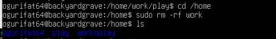