## NAMA : Averose Arthur R // Kelas : TI-1H/04

## 6.1
1. Jalankan ps aux dan amati outputnya Berapa total proses yang berjalan? Proses apa yang memiliki PID
terkecil?
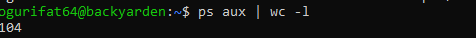
TERDAPAT 104 PROSES
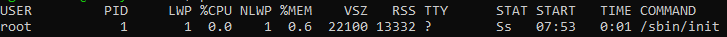
INI ADALAH PROSES DENGAN PID TERKECIL

2. Jalankan pstree -p dan temukan proses bash Anda. Proses apa yang
menjadi induk (PPID) dari bash tersebut?
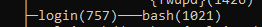
INDUK DARI BASH ADALAH Login

3. Bandingkan output ps aux dan ps aux -L. Apa perbedaan yang Anda
lihat?
ANSWER :
ps aux akan menampilkan process ringan seperti thread dalam 1 line saja.
sedangkan ps aux -L akan menampilkan semua proses thread yang digunakan dalam line berbeda tiap thread

## 6.2
1. Jalankan sleep 120 & dan amati kolom STAT pada ps aux. Kondisi
apa yang ditampilkan? Mengapa proses sleep berada di kondisi tersebut?
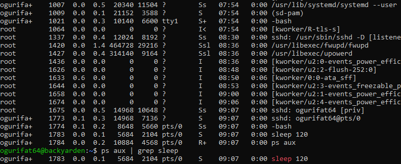
Proses sleep berada dalam status S (Interruptible Sleep) karena alasan teknis berikut:

Tidak Memerlukan CPU: Fungsi utama sleep adalah menunda eksekusi selama durasi tertentu. Selama durasi tersebut, proses tidak memiliki instruksi untuk dihitung oleh CPU.

Efisiensi Sumber Daya: Alih-alih terus-menerus bertanya pada CPU "Apakah sudah 120 detik?" (yang akan memakan penggunaan CPU 100%), proses ini mendaftarkan diri ke kernel untuk dibangunkan nanti.

Menunggu Timer: Kernel akan memindahkan proses dari Running State ke Waiting/Sleeping State.

Dapat Diinterupsi: Status S disebut interruptible karena meskipun sedang tidur, proses tersebut masih "mendengarkan" sinyal luar.

2. Jalankan beberapa perintah yang berhasil dan yang gagal, lalu catat exit
code masing-masing. Pola apa yang Anda temukan

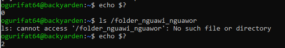
terlihat bahwa ketika program yang berhasil akan mengeluarkan exit code 0, dimana kode berhasil running

ketikan exit code 2, maka code yang dijalankan adalah erorr

## 6.3
1. Jalankan nice -n 5 sleep 200 & dan verifikasi nilai NI-nya dengan
ps.
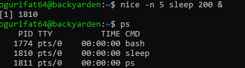
2. Ubah nilai nice menjadi 10 menggunakan renice, lalu verifikasi kembali.
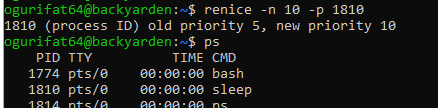

3. Coba ubah nilai nice menjadi -5 tanpa sudo. Apa yang terjadi? Mengapa
Linux membatasi hal ini untuk user biasa?
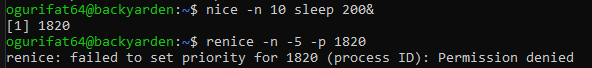

1. Mencegah Monopoli CPU (Starvation)
Nilai nice yang lebih rendah (negatif) memberikan prioritas lebih tinggi kepada proses tersebut di mata CPU Scheduler. Jika user biasa diizinkan memberikan nilai -20 pada semua proses mereka, mereka bisa memonopoli CPU secara total.
Akibatnya, proses sistem yang penting (seperti driver, antarmuka grafis, atau layanan jaringan) tidak akan mendapatkan giliran kerja, yang menyebabkan sistem hang atau tidak responsif.

2. Keadilan (Fairness) dalam Sistem Multi-User
Linux dirancang sebagai sistem multi-user. Jika setiap user bisa menaikkan prioritas proses mereka sendiri ke tingkat maksimal, maka akan terjadi "perang prioritas". User yang paling agresif mengatur nilai negatif akan mematikan produktivitas user lainnya. Pembatasan ini memastikan tidak ada satu user pun yang bisa merugikan user lain tanpa izin administrator.

3. Keamanan dari Serangan DoS (Denial of Service)
Tanpa batasan ini, seorang user (atau skrip berbahaya yang dijalankan user) bisa dengan mudah melakukan serangan Denial of Service lokal. Mereka cukup menjalankan proses komputasi berat dengan nilai -20, sehingga administrator bahkan mungkin tidak bisa menjalankan perintah kill untuk menghentikan proses tersebut karena terminal pun tidak kebagian jatah CPU untuk memproses perintah

## 6.4
1. Jalankan sleep 400 &, kirim SIGSTOP, dan amati perubahan kolom
STAT. Kondisi apa yang muncul?
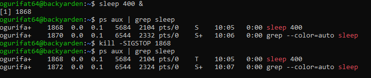
kondisi dari s menjadi t(t bermakna dihentikan sementara)

2. Kirim SIGCONT dan verifikasi proses kembali berjalan.
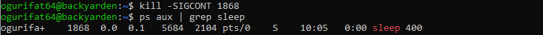

3. Hentikan proses dengan SIGTERM lalu verifikasi sudah tidak ada. Kapan
Anda memilih SIGKILL daripada SIGTERM?
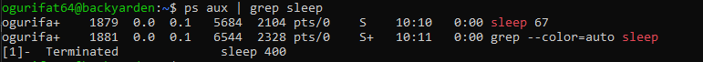

Sigterm digunakan ketika proses masih normal tanpa load tinggi

sigkill ketika proses perlu dipaksa end, secara paksa meng end suatu proses

## 6.5
1. Jalankan top di foreground. Apa yang terjadi di terminal?
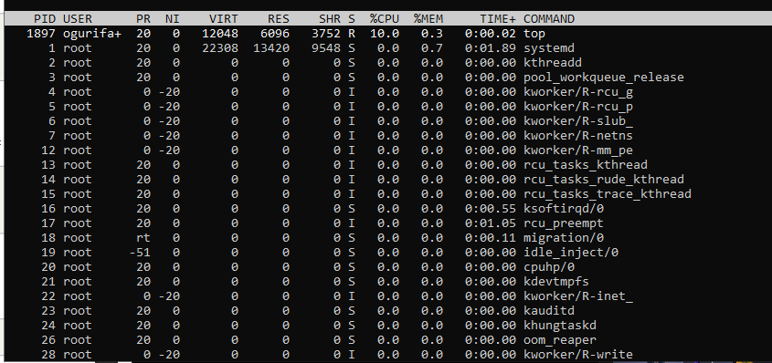

terminal menampilkan proses

2. Tekan Ctrl+Z dan cek statusnya dengan jobs. Kondisi apa yang
ditampilkan?
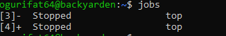
kondisi stop

3. Pindahkan ke background dengan bg. Apakah top dapat berjalan dengan
baik di background? Mengapa?

top tidak dapat berjalan dengan baik, maka di system akan menjadi status T (Stopped)

shell akan mendeteksi bahwa proses background mencoba menulis ke terminal

4. Kembalikan ke foreground dengan fg, lalu keluar dengan q .
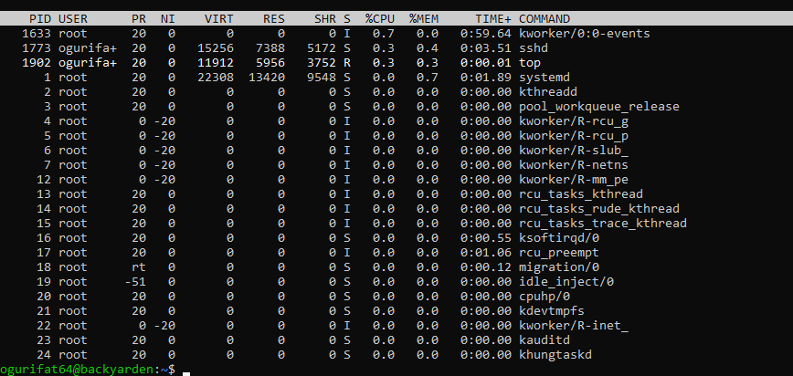

## 6.6
1. Gunakan ps aux –sort=%mem untuk menemukan proses yang menggunakan memori paling banyak di VM Anda. Proses apa itu?
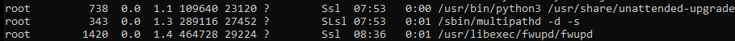

2. Di dalam top, tekan 1 . Apa yang berubah pada tampilan? Mengapa
informasi ini berguna?
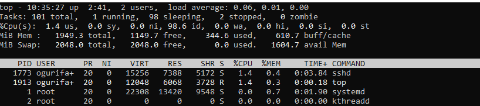
l
l
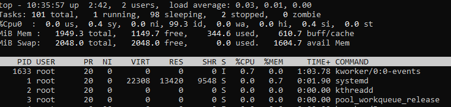
proses nya terlihat lebih detail dalam pengunaan cpu%

3. Di dalam htop, navigasikan ke proses sshd menggunakan tombol panah.
Tekan F9 dan amati opsi sinyal yang tersedia.
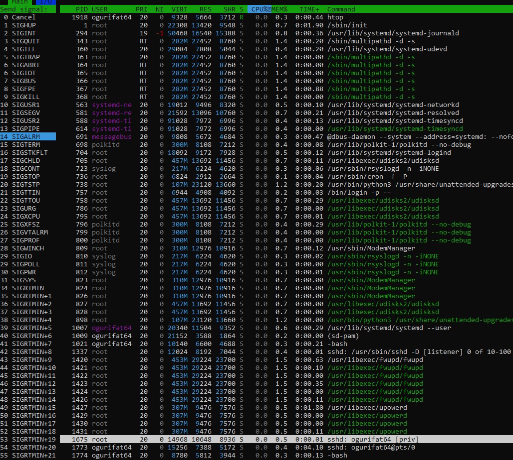

## 6.A
Eksplorasi Proses Sistem
1. Jalankan ps aux –forest dan temukan proses dengan PID 1. Apa
nama dan fungsi proses tersebut dalam sistem Linux modern?
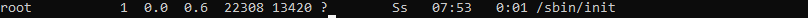

2. Hitung berapa proses yang dimiliki oleh user root dan berapa yang
dimiliki oleh user Anda. Mengapa root memiliki lebih banyak proses?
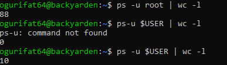

A. Kernel Threads dan Services Utama
Saat Linux melakukan booting, ia menjalankan ratusan layanan latar belakang 
(daemons) yang diperlukan agar sistem operasi bisa berfungsi.

B. Manajemen Perangkat Keras (Hardware)
Proses yang berinteraksi langsung dengan driver atau perangkat keras 
(seperti mengatur kecerahan layar, manajemen baterai, atau input keyboard) 
harus berjalan di bawah user root demi keamanan. User biasa dibatasi agar 
tidak bisa mengacak-acak instruksi perangkat keras secara langsung.

C. Penjaga Keamanan dan Log
Banyak proses root yang bertugas memantau keamanan sistem, memeriksa log aktivitas, 
atau menunggu permintaan koneksi (seperti SSH server). Mereka harus tetap berjalan ("standby") 
di latar belakang agar sistem tetap aman dan bisa diakses kapan saja.

D. Menjalankan Lingkungan untuk User
Bahkan proses yang memungkinkan Anda untuk login dan melihat tampilan desktop (seperti Display Manager)
awalnya dijalankan oleh root sebelum akhirnya "menyerahkan" sesi tersebut kepada user.

3. Temukan semua proses yang berada dalam kondisi S. Mengapa sebagian
besar proses di sistem berada dalam kondisi ini?
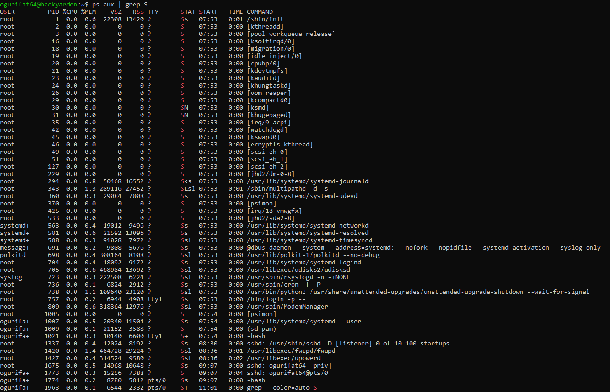

A. Menunggu Input atau Event (Event-Driven)

B. Menunggu I/O (Input/Output)

C. Efisiensi Penggunaan Daya dan Resource

D. Penjadwalan Kernel (Preemptive Multitasking)

## 6.B
Simulasi Manajemen Job
1. Jalankan tiga perintah sleep dengan durasi 100, 200, dan 300 detik di
background. Verifikasi ketiganya dengan jobs.
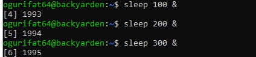

2. Bawa job kedua ke foreground, jeda dengan Ctrl+Z , lalu kembalikan
ke background dengan bg.
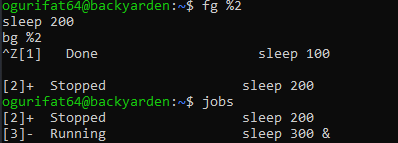

3. Hentikan job pertama dengan kill %1. Tampilkan kembali daftar job.
Berapa job yang tersisa?
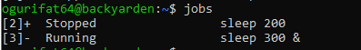

## 6.C
Prioritas dan Sinyal
1. Jalankan dua proses sleep: satu dengan nice +5 dan satu dengan nice
+15. Verifikasi nilai NI keduanya dengan ps.
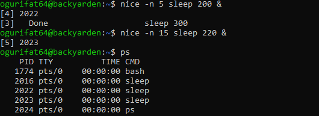

2. Gunakan renice untuk mengubah nice proses pertama menjadi +10.
Proses mana yang kini lebih diprioritaskan scheduler?
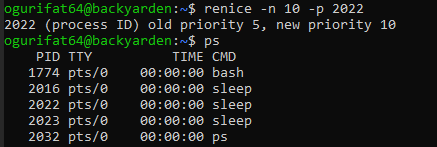

3. Kirim SIGSTOP ke salah satu proses, verifikasi kondisi T-nya, lalu kirim
SIGCONT. Akhiri semua proses percobaan dengan pkill sleep.

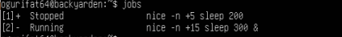

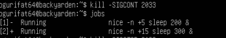

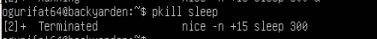