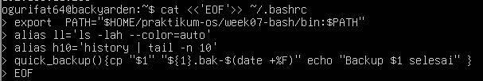
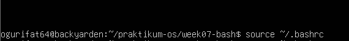
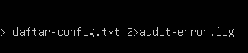
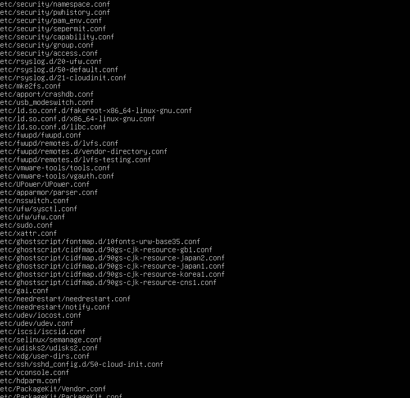
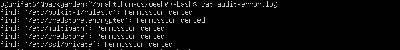
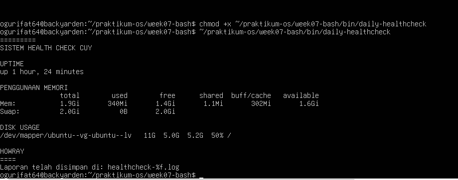
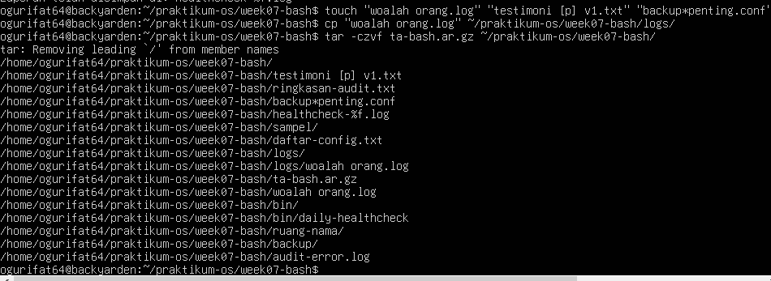

## NAMA : AVEROSE ARTHUR R // KELAS : TI - 1H / 04
## 254107020042
## LAPORAN MINGGU 7

## Tugas Praktikum 1 — Toolkit Bash Administrator
Pribadi
Konteks riil: seorang administrator sering mengulang perintah yang sama setiap
hari. Agar pekerjaan lebih efisien dan konsisten, ia perlu memiliki toolkit Bash
1 Bash Shell dan Shell Basic 19
1.8 Tugas Praktikum
pribadi yang otomatis aktif setiap login.
Instruksi tugas:
1. Tambahkan konfigurasi pada .bashrc untuk:
• menambahkan direktori bin pribadi ke PATH,
• membuat minimal 2 alias yang membantu kerja harian,
• membuat minimal 1 fungsi shell yang berguna untuk administrasi.
2. Pastikan konfigurasi tersebut aktif kembali saat membuka shell login.
3. Buat satu script sederhana di direktori bin pribadi, misalnya script untuk
menampilkan ringkasan sistem.
4. Uji dari direktori yang berbeda untuk memastikan script dapat dipanggil tanpa
menuliskan path lengkap.
5. Simpan bukti pengujian ke file toolkit-bash-report.txt.

## 1.
 
## 2. 
## 3.

## Tugas Praktikum 2 — Audit File Konfigurasi dan
Logging Aman
Konteks riil: saat troubleshooting, administrator sering perlu menginventarisasi
file konfigurasi dan memisahkan output normal dari pesan error.
Instruksi tugas:
1. Buat file laporan bernama audit-konfigurasi-$(date +%F).txt.
2. Cari file *.conf di dalam /etc dan simpan hasilnya ke file laporan.
3. Catat jumlah total file konfigurasi yang ditemukan.
4. Jika ada pesan error, simpan ke file terpisah, misalnya audit-error.log.
5. Tampilkan isi laporan ke terminal dan sekaligus simpan menggunakan tee.
6. Tambahkan ringkasan singkat 3–5 baris yang menjelaskan mengapa pemisahan

 

 

## Pemisahan stdout dan stderr sangat krusial dalam audit sistem karena memungkinkan administrator memfilter data operasional yang valid dari pesan kesalahan yang mengganggu. Dengan memisahkan keduanya, kita bisa mendapatkan daftar inventaris sistem yang bersih tanpa tercampur log "Permission Denied", sekaligus memiliki rekaman kegagalan akses yang spesifik di file terpisah untuk dianalisis lebih lanjut. Hal ini meningkatkan efisiensi pemantauan dan memastikan tidak ada indikasi masalah keamanan yang terlewat akibat tertumpuk oleh ribuan baris output normal.

## Tugas Praktikum 3 — Mini Health Check Harian
Server
Konteks riil: administrator perlu membuat pemeriksaan cepat (health check) untuk
mengetahui kondisi dasar server sebelum dan sesudah maintenance.
Instruksi tugas:
1. Buat script Bash bernama daily-healthcheck pada direktori bin pribadi.
2. Script minimal harus menampilkan:
• tanggal dan waktu,
• hostname,
• user aktif,
• shell aktif,
• uptime,
• penggunaan memori,
• penggunaan filesystem root,
• 10 baris terakhir history command yang relevan dengan pengecekan.
3. Simpan hasil ke file log harian, misalnya healthcheck-$(date +%F).log.
4. Tampilkan hasil ke terminal dan ke file secara bersamaan.
5. Jika Anda menggunakan pipeline dengan tee, cek juga status exit command

## Tugas Praktikum 4 — Penanganan File dengan Nama
Kompleks dan Arsip Aman
Konteks riil: file hasil backup, ekspor, atau laporan sering memiliki nama yang
mengandung spasi atau karakter khusus. Administrator harus tetap dapat memproses
file-file tersebut tanpa salah target.
Instruksi tugas:
1. Buat minimal 4 file contoh dengan nama yang bervariasi, termasuk:
• nama file yang mengandung spasi,
• nama file yang mengandung tanda kurung siku atau karakter khusus,
• file dengan pola nama serupa untuk diuji dengan wildcard.
2. Tunjukkan perbedaan hasil jika file diakses tanpa quoting dan dengan quoting
yang benar.
3. Lakukan preview wildcard dengan echo sebelum dipakai untuk operasi nyata.
4. Salin file-file tersebut ke direktori backup dengan nama yang aman.
5. Buat arsip tar.gz dari hasil backup.
6. Simpan riwayat perintah yang Anda gunakan ke file riwayat-arsip.txt.

